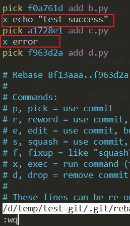

# Git
Chinese Blog: [30 Days-Git](https://ithelp.ithome.com.tw/users/20004901/ironman/525)、[Fundamental Guide](https://wikinote.gitbook.io/git-learning/git-ji-chu)、[Git Tutorial Blog](https://github.com/twtrubiks/Git-Tutorials)（Great！）

Git Practice: [W3schools](https://www.w3schools.com/git/default.asp)、[Visualizing Git Concepts](https://onlywei.github.io/explain-git-with-d3/)、[Git Immersion](https://gitimmersion.com/lab_01.html)、[Learn Git Branching](https://learngitbranching.js.org/?locale=EN)、[Git Tutorial](https://backlog.com/git-tutorial/)、[Git Command](https://www.atlassian.com/git/glossary)、[GitFlow-Considered-Harmful(Series)](https://www.endoflineblog.com/gitflow-considered-harmful)

Git Reference: [MIT missing-semester](https://missing.csail.mit.edu/2020/version-control/)、[A Visual Git Reference](https://marklodato.github.io/visual-git-guide/index-en.html)、[How to explain git in simple words](https://xosh.org/explain-git-in-simple-words/)、[Oh shit Git](https://ohshitgit.com/)、[Undo Operation](https://stackoverflow.com/questions/58003030/what-is-the-git-restore-command-and-what-is-the-difference-between-git-restor)、[Confusing-Git-Terminology](https://longair.net/blog/2012/05/07/the-most-confusing-git-terminology/)、[GitHub flow](https://docs.github.com/en/get-started/using-github/github-flow)、[Discover the .git Folder](https://medium.com/analytics-vidhya/git-part-3-discover-the-git-folder-ca3e828eab3d)


### Resource

- [How to explain git in simple words](https://smusamashah.github.io/blog/2017/10/14/explain-git-in-simple-words)
- [Learn Git Branching](https://learngitbranching.js.org/) is a browser-based game that teaches you Git.
- [Oh Shit, Git!?!](https://ohshitgit.com/) is a short guide on how to recover from some common Git mistakes.
- [Git from the Bottom Up](https://jwiegley.github.io/git-from-the-bottom-up/) is a detailed explanation of Git’s implementation details beyond just the data model, for the curious.
- [Git for Computer Scientists](https://eagain.net/articles/git-for-computer-scientists/) is a short explanation of Git’s data model, with less pseudocode and more fancy diagrams than these lecture notes.
- [Pro Git](https://git-scm.com/book/en/v2) is **highly recommended reading**. Going through Chapters 1–5 should teach you most of what you need to use Git proficiently, now that you understand the data model. The later chapters have some interesting, advanced material.
- **Other Git providers**: GitHub is not special: there are many Git repository hosts, like [GitLab](https://about.gitlab.com/) and [BitBucket](https://bitbucket.org/).
- **GitHub**: Git is not GitHub. GitHub has a specific way of contributing code to other projects, called [pull requests](https://help.github.com/en/github/collaborating-with-issues-and-pull-requests/about-pull-requests).
- **Editor integration**: similarly to the above, handy integrations with many features. [fugitive.vim](https://github.com/tpope/vim-fugitive) is the standard one for Vim.
- **GUIs**: there are many [GUI clients](https://git-scm.com/downloads/guis) out there for Git. We personally don’t use them and use the command-line interface instead.
- **Shell integration**: it’s super handy to have a Git status as part of your shell prompt ([zsh](https://github.com/olivierverdier/zsh-git-prompt), [bash](https://github.com/magicmonty/bash-git-prompt)). Often included in frameworks like [Oh My Zsh](https://github.com/ohmyzsh/ohmyzsh).
- **Workflows**: we taught you the data model, plus some basic commands; we didn’t tell you what practices to follow when working on big projects (and there are [many](https://nvie.com/posts/a-successful-git-branching-model/) [different](https://www.endoflineblog.com/gitflow-considered-harmful) [approaches](https://www.atlassian.com/git/tutorials/comparing-workflows/gitflow-workflow)).


[toc]

## Git Concept

### Git Flow

Git Flow 既不是一种技术，也不是一类具体语法，而是一种团队遵守的规范和工作流程。

### Git, GitHub

- Git 的安装

  Linux 使用各个发行版的包管理器安装。

  Windows [安装地址](https://www.git-scm.com/)，CLI 内键入：`git --version` 可以检查 git 是否正确安装。

- Git 的功能

  1. 通过使用 branch 分支的 git flow，开发、维护、管理本地、远程仓库平台上的项目。
  2. **追踪项目中代码的改变**，实现团队多人协同开发，记录项目文件的变动和开发的流程。

- 什么是 Git

  Git 本质是一个用于追踪代码改变，协同开发的**版本控制系统**（VCS）软件

  Git 并不保存每次 commit 时项目的副本，而是记录、追踪每次 commit 提交时项目中文件（目录）的改变。

  > 无论是本地、远程 Git 仓库，都包含着 git 提交历史，记录着每个贡献者的改动。

- 什么是 GitHub

  GitHub 本质是一个**远程仓库平台**（remote repo platform）而 Git 是对本地仓库进行项目管理的版本控制系统软件，本地仓库和远程仓库间通过 HTTPS、SSH 等网络协议传送数据，同步存储在本地和远程仓库平台上的项目。

  > 本地 Git 配置中需要使用和 GitHub 远程仓库平台相同的电子邮件地址。

  > 因此，安装 Git 后，第一件要做事就是告诉 Git 你的名字和电子邮件 user.name、user.email，并使用 `git config --global` 命令或者编辑相应的 Git 配置文件完成一些基本的设置。

- 配置 Git 

  使用 `git config --list`  命令可以查看当前本地 Git 的所有配置。一般可以使用如下命令，配置 Git：

  ```bash
  $ git config [--local|--global|--system] user.name "xxx"
  $ git config [--local|--global|--system] user.email  "xxx@xxx.com"
  $ git config [--local|--global|--system] init.defaultBranch [master]
  $ git config [--local|--global|--system] core.editor vim
  $ git config [--local|--global|--system] merge.tool [vimdiff]
  $ git config [--local|--global|--system] alias.co checkout
  ...
  ```

  或者直接编辑 Git 的配置文件中，根据项目、用户、系统三个范围分为：

  - 单个项目：`.git/config` 文件，如果没有参数传入，`git config` 命令默认将配置项写入该文件。
  - 用户范围：`~/.gitconfig` 文件，如果有 `--global` 参数传入，`git config` 命令将配置项写入该文件。
  - 系统范围：`/etc/gitconfig` 文件，系统范围内的设置，适用于整个机器。

  > `git config` 默认使用 `--global` 选项，在不设定 `user.name`、`user.email` 的情况下，甚至无法执行 `git commit` 命令。

  ```bash
  [user]
    email = xxx@xx.com
    name = gaoyuankan
  [core]
    ui = true
    editor = vim
    autocrlf = false
  [alias]
    co = checkout
    ci = commit
    st = status
    br = branch
    re = remote
    lg = log --pretty=format:'%an [%ad] %h | %d%s' --graph --date=short
    d  = difftool
    type = cat-file -t
    dump = cat-file -p
  [init]
    defaultBranch = master
  [pager]
    branch = false
  [diff]
    tool = vimdiff
  ```

  > 当这些文件中的配置选项发生冲突时，本地仓库配置优先于用户配置，优先于系统配置。手动编辑配置文件的效果，与执行 `git config` 命令的效果一样。

  配置完本地 Git 仓库后，可以在本地项目的根目录下键入 `git init` 命令初始化本地项目为本地仓库，或者使用 `git clone <url>` 命令从远程仓库平台上下载项目，构建本地仓库。

- 配置 GitHub

  配置 GitHub，即配置远程仓库。首先**在 GitHub 网址上 fork 或者新建（远程）仓库**，并在远程仓库中获取该仓库的 URL 地址（可以是 SSH、HTTPS）

  然后在本地仓库项目的根目录下，键入 `git remote add <local_remote_repo> <URL>` 命令，建立本地仓库与远程仓库的关联，`git remote -v` 可以检查本地仓库关联的远程仓库，`git branch -vv` 可以检查本地分支关联的远程分支。GitHub 远程仓库平台上，同一项目往往有 SSH、HTTPS 两个 URL 地址：

  ```http
  git@github.com:username/repo_name.git
  https://github.com/username/repo_name.git 
  ```

  SSH，secure shell protocol 网络协议，使用一对 SSH key（"public" and "private" key）建立一个基于认证加密的连接。不同于 HTTPS 协议，每次传递数据时，都需要输入用户名和密码；SSH 协议在本地、远程仓库间传递数据时，不需要繁琐的验证过程。可以做到一次配置，永久使用。具体配置过程如下：

  1. 检查本地系统是否存在 SSH Key  

     查看 ~/.ssh 文件夹中是否存在 xxx 和 xxx.pub 文件。

     ```bash
     $ cd ~/.ssh && ll
     ```

  2. （如果不存在，即）生成 SSH Key

     由于本地 Git 仓库和远程 GitHub 仓库间的数据传输是通过 SSH 协议加密的，所以我们需要 SSH key。此步骤可以不设置密码，避免以后使用 SSH 时反复输入密码（直接键入 Enter）

     ```bash
     $ ssh-keygen -t ed25519 -C "xxx@xxx.com"
     ```

     > ED25519 is generally **considered better**，如果在生成 SSH Key 时输入密码，那么需要使用 ssh-agent 去管理代码，并将 `eval $(ssh-agent -s)` 命令写进 shell 配置文件。
     >
     
  3. GitHub 远程仓库平台添加本地 SSH public key 
  
     一旦 `ssh-keygen` 命令完成 SSH Key 的生成，默认会在 `~/.ssh` 文件夹内默认生成 \<ssh-key-type\>和 \<ssh-key-type\>.pub，分别对应私钥和公钥。
  
     点击 GitHub 用户头像，选择 Settings。在 SSH and GPG keys 选项中新建一个 SSH Key。 取个名字，将系统文件 ~/.ssh/\<ssh-key-type\>.pub 公匙内容拷贝进去。
  
  4. 检验 SSH 与 GitHub 连接
  
     ```bash
     $ ssh -T git@github.com
     ```
  
  > 如果未配置 GitHub SSH Key，使用 SSH 协议时，会出现 `git@github.com: Permission denied (publickey)` 问题
  
  配置完 GitHub 后，如果在本地仓库项目的根目录下键入 `git push <-u|--set-upstream> <local_remote_repo> <local_branch>[:<remote_branch>]` 命令，会设置的本地分支 local_branch 的上流（远程分支）remote_branch，并推送到本地仓库关联的远程仓库 local_remote_repo。
  
  > 注意：如果 `git push <-u|--set-upstream> <local_remote_repo> <local_branch>[:<remote_branch>]` 命令省略 `:<remote_branch>`，`git push` 时会在远程仓库上新建一个和 local_branch 本地分支名同名的 remote_branch 远程（仓库）分支。
  
- **Pull Request（PR）**

  Git 的协作模式是基于本地仓库与远程仓库间的同步。Git 不区分中心和副本仓库repository（基于分布式实现）如果有权限，你可以从本地仓库推送任一 commit 到远程仓库也可以从远程仓库拉取任一 commit 到本地仓库。

  Pull Request（PR）是一种项目的开发、维护和管理的方式，你可以 push 本地仓库分支到远程仓库分支。当两个跨账号的远程仓库分支合并时，必须使用 PR 将开发者的工作（代码修改）整合到远程仓库前进行 Review 审核和讨论。

  1. 提交变更（Submit PR）

     当本地仓库分支的 commits 推送到上游远程仓库分支时，就可以在远程仓库平台的网页上选择对应的分支创建 PR 合并到项目源或其他（远程）仓库分支中。

  2. 审查/合并（Review/Merge）

     PR 提交后，项目的维护者会对该分支上的所有改动进行逐行的审查 review，查看是否有考虑不周或者更好的方案，在这过程中，你**可以根据建议随时改进代码，然后重新 push 到对应的上游仓库分支上，PR 会同步改动**。当所有的改动都被批准 approval  后，PR 就会被合并啦！

  > 如果 PR 改动很大，想边改边得到别人及时的反馈，可以在创建 PR 时，在标题上加上 **[WIP]** 是 Work In Progress 的缩写，表示工作还未完成。

  一旦你在远程仓库分支上有了代码修改，就可以创建一个 PR，当代码经过 review 审查，得到 approval 批准后，便会 merge 合并 PR 内容：将 push 至远程仓库分支中的更新内容合并至主仓库的主分支。对于远程仓库 GitHub 平台上，最重要的操作即 `create pull request` 和 `merge pull request` 管理主分支。

  Git clone and Git fork 可以被理解为:

  - Cloning: From Remote Repo Platform To Local Git Repo
  - Forking: From One Remote Repo To Another Remote Repo

  

  PR 操作本身并不复杂，只是在选择 Merge pull request 的方式时：

  1. Create a Merge Commit

  2. Squash and Merge (to a commit)

  3. Rebase and Merge (to keep commits)

  > 使用 gh CLI  命令行工具，依旧可以实现 PR 操作。
  
  当你从一个 GitHub 平台远程 Repo 仓库上 Fork 一个开源项目时，会在自己的 GitHub Repo 中创建一个完全独立且相同的远程仓库副本，但该项目只保留在远程 GitHub 仓库平台上，而不会出现在本地仓库上。
  
  **Fork 不是 Git 的命令，而由 Github 平台提供，仓库所有者授权共享的选项**。 fork 后的远程仓库是独立于源仓库的，它是原始远程仓库的拷贝，但拥有原始远程仓库的所有分支和 commit history 历史记录。即使原始远程库被删除，fork 得到的拷贝远程仓库仍然存在（开源！）
  
  然而，当你在本地使用 `git clone` 命令克隆一个远程 GitHub Repo 仓库时，该远程仓库中的内容通过 SSH 或 HTTPS 协议在 Git 的帮助下复制到本地机器的本地仓库上。与此同时，GitHub 远程仓库平台上没有发生任何事情，但本地仓库已经和远程仓库已经建立了联系。通过 `git remote -v` 或 `git remote show <local_remote_repo>` 命令，可以查看本地仓库和对应追踪的（上游）远程仓库。
  
  > 相对于 `git clone` 命令，建立远程仓库和本地仓库的联系。Git fork 是 GitHub 平台上，一种远程仓库的拷贝形式。
  
  > Git 本身是分布式 VCS 版本控制系统软件，可以同步本地仓库到远程仓库，也可以同步远程仓库到本地仓库，而且不限制远程仓库的数量和形式。如果想通过 Git 实现项目的团队开发、合作，就需要能够拉取远程仓库，并将本地仓库的项目推送到其他开发人员也能够连接到的公共远程仓库上。

### Git Data Model

Git 将 working directory 工作区（项目的根（顶层）目录）中的 file 文件和 directory 目录视为 object 对象集合，并通过一系列 snapshot 快照来管理其 commit 提交记录。

在 Git 的术语中，file 文件中的内容会被存储在一个称为 Blob 的（数据）对象中。每当 file 文件中的内容被修改后，就会产生一个新的 Blob（数据）对象用**记录文件修改前后的变化**。

Blob（数据）对象记录的 file 文件变化，需要存储在对应的 directory 目录中。而 directory 目录中的内容，在 Git 中会被存储在一个称之为 tree（树）的对象中。tree（树）对象将该目录下的文件名、子目录名（字符串）映射到与之对应的 Blob （数据）对象或 tree （树）对象中。


snapshot 快照（commit）则记录项目的根（顶层）目录的 tree （树）对象。

在 Git 数据模型中，Blob、tree、snapshot （commit）对应的数据、树、快照对象，统一通过 [SHA-1 hash](https://en.wikipedia.org/wiki/SHA-1) 储存。这是一个干净、简单的历史模型。用伪代码写下 Git 的数据模型可能会更有启发：

```python
// blob 数据对象表示文件
type blob = array<byte>

// tree 树对象表示当前目录，通过文件名、目录名实现到 blob tree 对象的映射，完成关联
type tree = map<string, tree|blob>

/* 每个 commit 提交都包含其 parent 的父亲 commit 信息，snapshot 项目根（顶层）目录树对象和一些元信息（如：timestamp、message、author、info）*/
type commit = struct {
    parent: array<commit>
    snapshot: tree
    info：string
    author: string
    message: string
    timestamp：string
}
```

> 由于 `git merge` 命令产生的 commit 对象有多个 parent commit 父对象，所以 commit 中 parent 的类型是 array<commit\>。

Git 通过 SHA-1 hash 函数处理 Blob，tree，commit 对象后得到的 hash 值，作为 key 记录在 tree 对象中：

```python
// Git 中的 object 可以是 blob、tree、commit：
type object = blob | tree | commit
objects = map<string, object>


def store(object):
    // sha1(object) 为 hash 函数
    id = sha1(object)
    // 利用 hash 函数计算得到的地址，存储 blob、tree 或 commit 对象
    objects[id] = object

def load(id):
    return objects[id]
```

ref 引用是指向 commit 提交的指针。与 blob、tree、commit 对象不同的是，它是可变的（理解为指针，指向 commit 提交）

Git 使用诸如 master 这样人类可读的 branch 分支名（引用）指向历史记录中某个特定的提交，而不需要直接使用一长串 hash 十六进制字符了。Git 中，有一个特殊的二级引用 HEAD，指向当前分支的 commit 位置。

```python
references = map<string, string>

def update_reference(name, id):
    references[name] = id

def read_reference(name):
    return references[name]

def load_reference(name_or_id):
    if name_or_id in references:
        return load(references[name_or_id])
    else:
        return load(name_or_id)
```

**在硬盘上，Git 仅存储 blob、tree 、commit 对象和 ref 引用：因为其数据模型仅包含这些东西。所有的 git 命令都只对三大 object 对象，ref 引用，以及 DAG 中对应的 commit 提交记录机型操作。**在输入某条 git 命令后，可以思考一下这条命令是如何对底层 commit 历史记录对应的 DAG 有向无环图进行操作的。

Git 中的 commit（本质上）是不可修改的。但这并不代表着不能修改历史 commit 记录，只不过这种“修改”实际上是通过 `git commit --amend` 命令创建了一个新的 commit 记录替代当前最近 commit 记录提交内容。或者使用 `git revert <commit_id>`、`git rebase <src_branch> [dst_branch]` 或 `git rebase -i <commit_id>` 命令在（当前或指定）分支创建了新的 commit 记录重做 \<commit_id\> 中的内容。

> 时刻谨记，Git 中的 principle： Messing with the (remote) public `commit` history of a repository can be dangerous. Such as avoid making changes that rewrite history to `remote` repositories due to others are working with them.

.git 目录记录当前项目工作所需要的所有数据：

- config

  config 文件内容，记录着当前项目的配置文件。这里的配置项拥有更高的优先级，相同配置项，这里的内容将覆盖其他 .gitconfig 文件中的配置项。

- HEAD

  HEAD 文件内容，记录着指向当前分支的二级引用。`cat .git/HEAD` 返回 `ref: refs/heads/<branch>` \<branch> 即 HEAD indirect reference 引用所指向的当前分支。

- objects/

  objects/ 目录中子目录的名字是 git 存储（blob|tree|commit ）对象 sha1 哈希值的前 2 个字母。子目录里的文件名即这些（blob|tree|commit）对象 sha1 哈希值的后 38  个字母。

  要想查看（blob|tree|commit ）对象的类型，可以键入：`git cat-file -t <hash_of_object>` 命令；要想查看（blob|tree|commit ）对象的内容，可以键入：`git cat-file -p <hash_of_object>` 命令。

  > `.git/objects/` 目录就是 git database 数据库存储的地方。
  > `git tag <tag_name> <commit_id>` 命令默认在 `.git/refs/tags` 目录下生成 lightweight tag 轻量标签。只有 `git tag <tag_name> <commit_id> -a -m "message"` 会生成 annotated tag 标注标签，并生成相应的 tag commit 对象。

- refs/

  refs/ 目录下有 refs/tags、refs/stash、refs/heads/、refs/remotes 四个子目录，分别对应标签、储藏、本地分支、远程分支四种 reference。

  refs/tags/ 子目录下的 lighting tag 轻量标签，只是其记录的某个 commit 的别名，而 annotated tag 标注标签，指向对应的 tag commit 对象。

  refs/heads/ 子目录下的每个文件对应本地分支。在 refs/heads/<branch\> 文件内容是 <branch\> 分支所（指向）绑定的（最后一条）commit 记录的 hash 哈希值。

  > Remember: **tags and branches are just pointer**. 无论是 lightweight tags 标签，还是 annotated tags 标签，都存储在 .git/refs/tags/ 目录下（只是 annotated tags 实际指向生成的 tag commit 可保存更多信息）

## Git Repo

### Git Ignore

使用 Git 版本控制系统软件进行代码协同工作时，可以使用 `.gitignore` 文件指定当前目录下哪些文件或者子目录不被追踪。

**`.gitignore` 文件显示指定需要忽略的文件，只用于 Untracked Files**，即那些从来没有被 Git 记录过的文件（从未被 git add 过的文件）如果文件曾经被 Git 记录过，那么 `.gitignore` 就对它们完全无效，需要使用 `git rm --cached` 命令从 staging area(index) 中删除。

> `.gitignore` 文件可以用于本地仓库项目的（底层）根目录，也可以用项目的某个子目录。
>
> `git rm <file>` 从 working directory 工作区和 staging area 暂存区删除文件，彻底删除。

**.gitignore 文件语法：**

0. `name`	# 所有名为 name 文件、目录都被忽略
1. `/name`      # 仅忽略当前目录下名为 name 文件，不包括 subdir/name
2. `name/`      # 忽略 name/ 目录下的所有文件和子目录，但不会直接忽略文件；

注意：如果子目录中没有显示指定 `.gitignore` 文件，**`.gitignore` 文件是会 -r 递归搜索当前目录下的所有文件和子目录内容并应用的。**

**设置 global  .gitignore 文件**：

```bash
$ git config --global core.excludesfile <path>
```

执行完上述命令后，便将下面内容添加到 ~/.gitconfig 文件中：

```
[core] 
	excludesfile = <path>
```

再次证明了，操作 git 命令设置配置，和直接编辑配置文件的等同效果。

### Git Local Repo

Git local repo 本地仓库由 Git 维护的三棵"树"组成。第一棵树是 `项目根（顶层）目录（working directory）`，它持有当前项目的所有文件；第二个是 `暂存区（Index or Staging）`，它是个缓存区域（临时）保存下一次提交 commit 时项目的代码改动；最后是 `HEAD` 指向当前分支最后一次提交的 commit 记录。

- working directory

  working directory 项目根目录（工作区）下的所有文件或者子目录都不外乎两种状态：

  - traced 已跟踪：指的是已经被纳入版本控制的文件或子目录。
  - unknown 未知：分为两种：untraced 未跟踪、 ignored 已忽略（在 .gitignore 文件中设置）的文件或子目录，.gitignore 文件只对 untraced 的文件生效。

  > 任何文件、子目录第一次向仓库添加时，都是 untraced 未跟踪的。要让 Git 跟踪它们，需要将它们先添加到暂存区中，不可以直接使用 `git commit -a <files>` 命令跳过 `git add <files>` 命令。

- index or staging

  暂存区（staging）也称为索引区（index）作为下一次 commit 提交的环境，是一个和数据模型完全不相关的概念。它用来保存下次 commit 提交时项目的改动。而 Git 数据模型保存的则是 Git 记录的内容。 Git 中**已跟踪的文件**可分为以下几种状态：

  - 上次提交后（未修改）
  - 未提交（已修改）但未暂存，可以使用 `git checkout -- <File>` 撤销指定文件在工作区的修改
  - 未提交（已修改）但已暂存，可以使用 `git checkout -- HEAD <File>` 撤销指定文件在工作区和暂存区的修改，`git reset <File>` 撤销指定文件在暂存区中的修改

  > Git 通过 index or staging "暂存区 "的机制来**指定项目中有哪些修改，应该包含在下一次 commit 提交的记录中**。

- Commit history

  在 Git 中，commit history 历史记录形成的是一个有向无环图（DAG）因为 Git 中的每个 commit 记录的parent commit 都是在它之前提交的记录。

  在下图中，o 对应单个 commit 记录。箭头指向 commit 记录的父亲（注意：前后关系）在第三次 commit 提交之后，历史记录形成两个分支。这对应着 `git branch` 命令：

  ```
  o <-- o <-- o <-- o
              ^
               \
                --- o <-- o
  ```

  当两个独立分支中的某一个分支，在第三次 commit 提交后，完成其对应功能后，上图中的 branch 分支可以被 merge 合并，创建一个新的 commit 记录，或者 rebase 包含这两个分支上独立开发的功能，看起来像下图这样：

  ```
  o <-- o <-- o <-- o <---- o(new commit)
              ^            /
               \          v
                --- o <-- o
                
  o <-- o <-- o <-- o (feature branch)
              ^            
               \          
                --- o <-- o (rebse to here) <-- o (same content, but not same commit)
  ```

  在 Git 中我们可以查看到项目创建以来提交的所有 commit 记录，而每一个 commit 记录都会指向、也只会指向它先前更老的 commit 记录，不会指向当时未出现的新记录。各个 commits 记录形成的 DAG 记录了项目中的所有改动。

  Git 每一次提交 commit 记录时，并不会盲目地复制整个项目内容。而只是将当前仓库 staging 暂存区记录的信息与 commit history 历史记录中的上一个 commit 记录进行对比，**并把所有的差异打包到一起作一个 snapshot 快照，形成一个 commit 记录提交**。

  > Git 中的 commit 记录是不可改变的。而对 history of commit 历史记录的 "编辑 "是指创建一个全新的 commit 记录，用该 commit 记录新的提交

- HEAD

  我们需要一个 reference 引用，**在 history commit 历史记录中定位当前所在的位置**，这样当我们新建一个 commit 记录时，就能快速找到它的父 commit 节点。Git 中，这种特殊的 reference 引用即 HEAD。

  不同分支上的 commit 是独立又相互关联的。**当多个 commit 记录指向同一个先前的 commit 记录时，就形成了 branch 分支的概念**。不同分支上的 commit 是相互独立的，**当一个 commit 记录同时指向多个先前（不同分支上的）commit 记录时，就形成了 merge 合并的概念**。

  Git 仓库中，可以有任意多个 branch 分支和 tag 标签作为 reference 引用，**但永远只有一个标定当前所在位置的二级 reference**，HEAD，指向当前分支上最近提交的 commit（分支也指向其最近提交的 commit）**commit 记录是不可以移动和修改的，但 branch分支是可以生长、 HEAD 二级 reference 引用是可以移动的。**Git 仓库的所有分支中只有一个可移动的 reference HEAD。

  > 注意：**当 HEAD 没有指向 Git 中的某个分支（最近提交的 commit）时，此时 HEAD 就处于 detached 状态（一级 reference 引用）**此时 HEAD 更新，没有对应的分支随着更新，如果没有新的 branch 被创建出来，detached HEAD 后的所有 commit 都会在下一次 checkout 后被丢失。
  >
  > 因为 local_remote_branch 本地远程分支，只可读，不可更新，因此**当 `git checkout` 到本地远程分支后，HEAD 处于 detached 状态。**local_remote_branch 的更新需要 `git fetch` 等命令。

注意：**working directory 工作区和 index（staging）暂存区的内容为所有 branch 分支所共用**。但 HEAD 可以指向任何一个branch 分支（最近提交的 commit）甚至可以指向 commit history 中的任一 commit 记录（可能会导致 detach）

### Git Remote Repo

远程仓库并不复杂，实际上它们只是**本地仓库在另一个远程（计算机）平台上的拷贝**。通过网络协议（如：HTTPS、SSH 等）建立本地仓库与远程仓库通信 —— 即 push 推送或者 fetch、pull 拉取 commits 记录。

远程仓库作为一个强大的备份，具有恢复本地项目代码至远程仓库指定版本的能力，因为远程仓库上的所有的信息都是可以拉到本地保存的。有了远程仓库以后，即使本地仓库丢失了数据，仍可以通过网络协议从远程仓库获得提交过的历史数据。

> **关于 Git 远程仓库的操作实际可以归纳为两点：向远程仓库传输数据以及从远程仓库获取数据。**

- git clone 拷贝远程仓库

  `git clone <url> <directory>` 命令会复制远程仓库上的工程到本地目录。其中 \<url\> 为远程仓库平台（如 Github）上的 SSH 或 HTTPS URL 项目地址；\<directory\>  为克隆到本地的（目录）路径。

  - **`--depth <num>`** 选项：将远程仓库平台上存储的 history of commits 历史记录截断至最近 <num\> 个
  - `<-b|--branch> <branch|tag(ref)>` 选项：可以指定克隆的远程仓库分支、或标签，而不是远程 HEAD 所指向的分支

Git 与 Github 章节中，已经介绍了关于 Git fork 和 Git clone 的异同：git fork 是远程仓库平台上的拷贝操作，将源远程仓库平台上的项目复制到自己的远程仓库平台上。而 git clone 命令是建立远程仓库与本地仓库联系的命令。

`git clone` 命令**会在指定目录（默认是当前目录）下创建一个和远程仓库平台项目的同名本地拷贝**。克隆的本地仓库除了会在本地创建一个和远程仓库 HEAD 同名的**本地分支**外，还会创建名为 `<remote_name>/<branch_name>` 的**本地远程分支**对应远程仓库分支。

> 默认情况下，`git clone` 命令远程仓库上的完整历史记录都会被保存在本地，默认的分支名为远程仓库的 HEAD 分支。`--depth`、`<-b|--branch>`、`<directory>` 可修改默认选项。

- git branch 本地仓库分支
  - `git branch -vv` #查看本地仓库本地分支的详细情况
  - `git branch -avv` #查看本地仓库本地分支、本地远程分支的详细情况
- git remote 设置远程仓库
  - `git remote -v` #查看远程仓库信息
  - `git remote rm remote_name`  # 删除远程仓库
  - `git remote add remote_name url` # 添加远程仓库
  - `git remote set-url remote_name url` #修改远程仓库地址
  - `git remote rename <old_remote_name> <new_remote_name>` # 修改仓库名

`<remote_name>/<branch_name>` 本地仓库远程分支反映了本地仓库与远程仓库最后一次通信时的远程仓库的状态。由于本地远程分支看成是只读的分支，该分支不可以在本地更新，只能通过 `git fetch`、`git pull` 命令更新。所以**当本地仓库 checkout 到本地远程分支后，本地远程分支 `<remote_name>/<branch_name>` 自动进入 detached HEAD 状态。**

> 当使用 `git clone` 某个仓库时，Git 已经帮你把 <url\> 对应的远程仓库名设置为 `origin` 了。同时, Git 会从**远程仓库拉取所有远程分支**在本地仓库创建对应的 `<remote_name>/<branch_name>` 本地远程分支，并默认保存所有的 commit history。

> **本地远程分支需要通过命令和远程仓库对应分支保持同步，因此不能直接在这些（本地）远程分支上进行操作**，而且本地远程分支默认也是只读属性的。因此，**本地仓库 checkout 到本地远程分支后，本地远程分支 `<remote_name>/<branch_name>` 自动进入分离 HEAD 状态。**

- git fetch 从远程仓库获取更新

  `git fetch <remote_repo> (<remote_branch>(:<local_branch>))` 命令从远程仓库上获取 <remote_branch\> 分支的最近更新到本地（只读）远程分支 remote_repo/remote_branch。`git push` 命令的意义与之恰好相反。

  1. 当 `git fetch` 命令只指定 `<remote_repo>` 参数，默认从远程仓库上下载所有有更新的分支到本地远程分支。
  2. 当 `git fetch` 命令指定 `<remote_repo> <remote_branch>` 参数时，会从远程仓库上的 <remote_branch> 分支上更新最近 commit 提交内容，**下载到本地远程分支** remote_repo/remote_branch。
  3. 当 `git fetch` 命令指定 `<remote_repo> <remote_branch>:<local_branch>` 参数时，会从远程仓库上的 <remote_branch> 分支上更新最近 commit 提交内容，**下载到本地远程分支** remote_repo/remote_branch 和本地分支 local_branch。

  

  git fetch 命令从远程仓库获取分支上的更新数据时，本地远程分支会（同步）更新至最新的远程仓库分支所指向的 commit 记录。`git fetch` 命令完成了仅有的但是很重要的两步：从远程仓库下载、更新本地远程分支 `<remote_repo>/<branch_name>` 中缺失（behind）的 commit 记录。

  git fetch 命令从一个远程仓库上下载获取的所有关于远程分支上的更新，取来的元数据都保存在 .git 目录下，而本地工作目录保持不变。由于工作目录状态不受影响，获取的远程分支更新内容必须使用 git checkout 命令检出 `<local_branch>` 创建的本地分支，或者结合 `-b <new_local_branch>` 新建本地分支。

  > `git fetch` 命令实际上**将本地仓库中的本地远程分支更新成了远程仓库相应分支最新的状态**。可以将 `git fetch` 的操作理解为单纯的下载操作，以实现本地和远程的通信。

  > `git fetch` 命令不使用任何分支参数时，会下载指定远程仓库里**所有分支**上更新的 commit 记录到本地远程分支。`git fetch` 并不会改变本地仓库中已有本地分支的状态，更不会修改任何本地或暂存区的文件。

  `git checkout -b <local_branch> <remote>/<remote_branch>` == `git fetch <remote> <remote_branch>:<local_branch>`

- git merge 将下载更新的本地远程分支合并到本地分支

  `git merge <specified_reference>` 命令，默认在当前分支上创建一个新的 commit 提交，合并 <specified_reference> 分支内容到当前分支。

  - 当前分支在与需要合并分支分岔后没有不同 commit

    把当前分支的位置快速移动到合并分支的最新的 commit 上，Git 即完成 merge 合并动作。这样的合并方法被称为 fast-forward（快速）合并。

  - 当前分支在与需要合并分支分岔后有不同的 commit

    要把当前分支的修改内容（新 commit 提交内容）和需要合并分支上的修改内容汇合起来。因此，合并两个分支的修改需要新建一个 commit。同时，当前分支的 HEAD 会移动到此新提交上。

  **如果本地分支不进行 git merge 合并对应的远程分支上最新的更新，就试图 git push 覆盖远程分支的话，那么会因为本地分支有落后于对应远程分支的提交而被拒绝**。

  为了 `git push` 本地分支新的 commit 内容到对应的远程仓库分支，首先要保证本地分支已经**更新（包含）**对应远程仓库分支中最新变更。意思是需要 fetch 下载并合并本地远程分支，至于合并具体是用 rebase 还是 merge，并没有限制。

  > git merge 不使用任何参数时，会合并所有本地远程分支到对应的本地分支。

  > git merge 命令默认使用 fast-forward 快速合并，移动分支。如果添加 `--no-ff` 选项，确保即使在可以使用 fast-forward 快速合并的情况下，也要新建一个 commit 提交。

- git rebase 复制当前分支（分岔）内容到指定分支上

  git merge 和 git rebase 命令是 Git 用来合并一个分支上内容到另一个分支上的两个大命令。相对于 git merge 命令总是 forward 向前移动，使用 git rebase 命令的重要原因是可以维持线性的 commit history 提交历史，但会修改 commit history 提交历史。其中，git rebase 命令就有 "standard" 和 "interactive" 两种模式修改 commit history 提交历史：

  - standard mode

    `git rebase <ref>` 命令使用 standard 标准模式，自动将当前分支上的分岔（新）commit 记录**复制**到 <ref\> 引用所指向的 commit 记录后，可以是 tag 标签，branch 分支，HEAD(~<num\>) 的相对 commit 记录，或者直接是 commit ID 哈希值 .

  - interactive mode

    `git rebase -i <ref>` 命令使用 interactive 交互模式，不会盲目的将当前分支上的分岔出来的所有（新）commit 记录复制到 <ref\> 所指向的 commit 记录后。interactive 模式，交互式地由你来决定这些 commits 记录该如何处理。

    Interactive 交互式 git rebase -i 命令会调用编辑器，打开一个界面，列出所有要复制到 <ref\> 引用后的 commit 提交记录。你可以**输入命令操作每一个需要 rebase 的 commit 记录**。这些命令决定了这些 commit 记录在 commit history 中将如何被重写。

  当知道所需要的 commit 记录（哈希值）时，使用 `git cherry-pick` 命令再好不过了。如果不清楚想要的 commit 提交记录（哈希值）使用 `-i` 参数的 `git rebase -i <ref>` 交互式命令，会打开一个界面列出将要复制到 <ref\> 引用后的 commit 提交记录，它还会显示每个提交记录的哈希值和提交说明。

  git rebase 命令和 git merge 命令两者实现方向不同：`git rebase <branch_name>` 和 `git merge <branch_name>`，分别复制当前分支上的分岔 commit 内容复制到 <branch_name> 分支上，将 <branch_name> 这个需要合并分支上的分岔 commit 内容到合并到本地分支，并创建一个新的 commit 提交。

  > 使用 `git rebase -i <ref>` 命令可以交互式地**对当前分支至 <ref\> 引用上的分岔 commit 记录进行重新排序、压缩等操作，进而修改 commit history**。

  因为 git fetch 命令并不会合并远程仓库分支上的更新 commit 内容到本地仓库（已有）分支，但一定会下载到本地远程分支（只读分支）一些开发人员，在合并（本地）远程分支时，喜欢保留 commit history 提交历史，因此更偏爱 git merge 命令。而另外一些开发人员可能更喜欢干净的 commit history 提交树，于是偏爱 git rebase 命令。

  1. `git rebase <branch>` = `git rebase <branch> <current_branch>`

  2. `git rebase --onto <basic_ref> <media_ref> <current_ref>` 命令复制从 <media_ref >开始（的下一个 commit 记录）到 <current_ref> 结束的 commit 记录到 <basic_ref >所指向的 commit 记录位置后，这是一个经典的三方交互的 rebase 动作。`git rebase --onto featrue~N feature~M featrue` 命令将会删除 feature 分支 (N, M]  区间范围内的 commit 记录。

- git pull 将远程仓库分支变化更新到本地（已有）分支

  `git pull <remote> <remote_branch>:<local_branch>` 命令先从远程仓库分支上下载更新的 commit 记录，再合并到本地分支这个流程。`git pull` 就是 `git fetch` 和 `git merge` 的缩写。如果将本地远程分支 <remote\>/<remote_branch\> 与当前分支合并，则冒号后面的 local_branch 部分可以省略。

  > 相对于 `git fetch <remote> <remote_branch>:<local_branch>` 新建一个 local_branch 内容完全和 remote/remote_branch 相同、 `git pull <remote> <remote_branch>:<local_branch>` 合并 remote/remote_branch 分支内容到 local_branch 中。

  - 本地分支在上次 git pull 后没有新的更改

    执行默认的 fast-forward merge 合并策略。

  - 本地分支在上次 git pull 后有新的更改，与对应的远程仓库分支形成分岔

    需要合并远程仓库和本地仓库上的修改，如果没有 conflict 冲突的代码出现，默认的 merge 动作就创建一个新的 commit 提交合并本地和远程仓库上的修改。如果发生冲突的话，要先解决冲突，修改，再次 git pull。

  > 在执行 git pull 之后，如果在进行下一次 git push 之前，如果其他人推送内容到远程仓库的话，会因为本地仓库分支和远程仓库分支出现分岔，而拒绝 git push 请求（git push 时本地远程分支不可以落后远程分支）

  当使用 `git fetch` 命令在本地下载远程仓库分支更新 commit 记录时，如果远程分支中有新的 commit 记录下载到本地远程分支时，可以像合并本地分支那样来合并本地远程分支。可以执行以下命令：

  - git merge  <remote_repo>/<branch\>
  - git rebase <remote_repo>/<branch\>
  - git cheery-pick <remote_repo>/<branch\>

  > 在多人协作环境下工作的任何时刻，都应该先将远程仓库项目中的最近更新通过 git fetch、git pull 等命令拉取、合并到本地仓库项目中。

- git push 将本地分支的提交记录推送到远程仓库分支上

  `git push <remote> <local_branch>:<remote_branch>` 命令将本地仓库分支上的 commit history 记录历史同步上传（推送）到远程仓库分支上。如果远程分支名与本地分支名相同，则可以省略冒号：以后内容。

  > 注意：**在本地（仓库）分支上可以随意工作**。但**在推送本地（仓库）分支前，需要保证工作的正确性，并更新远程（仓库）分支上的 commit 记录**。

  一旦 `git push` 命令成功执行，其他协同开发人员就可以用 `git fetch` 或者 `git pull` 命令从这个远程仓库上下载最新的项目代码变动（commit history）

  当未及时使用 `git fetch` 或者 `git pull` 命令同步更新远程仓库而导致本地仓库分支和远程仓库分支的项目代码（commit history）发生分岔偏离时。Git 是不允许（直接）使用 `git push` 变更的。实际上它需要保持与远程仓库的同步，才能发布本地代码工作。

  在同步本地和远程仓库分支后，使用 `git push` 命令发布本地仓库的项目代码（commit history）时，会将本地仓库分支中新建的 commit 记录添加到远程仓库对应分支中去。从而实现本地、远程仓库分支的同步。不同于 `git push` 命令，把本地仓库分支上的 commit history 提交历史推送到远程仓库分支上。`git pull` 命令通过相反的方向，从远程仓库分支中获取 commit history 提交历史到本地仓库分支中。

  > Tips：通过保证只在 master 分支上做 push、pull —— 这样的话 master 分支总是本地最新的，且与远程分支 (origin/main) 保持一致。

当我们使用 `git fetch` 和 `git pull` 命令时，我们是在与远程仓库工作，这两个命令都是想从远程仓库托管平台（网站）的远程分支中下载更新的 commit 记录，到本地远程（跟踪）分支。如同所示：`git fetch` 和 `git pull` 命令的不同在于：`git pull` 先执行 `git fetch` 命令后，再执行 `git merge` 命令。 


下面是关于何时选择 `git merge`，或 `git rebase` 命令的建议：

**A. 以下情况建议使用 `git merge`：**

- 想把某个分支的修改添加到主分支。
- 想要保留完整的 commit history 提交历史和 chronological order 时间顺序。

**B. 以下情况建议使用 `git rebase`：**

- 想要压缩多个提交。
- 保持一个精简的线性 commit history 提交历史。

> 相对于 `git rebase` 命令，`git merge` 命令不会修改 commit history 提交历史，但合并分支时会引入 merged commit。

## Git Command

通过前几节的学习，我们可以初步掌握以下关于 git 的本地、远程的命令。一个简单的 Git 工作流所需做的工作：

- 创建并检出一个分支。
- 在新的分支中做改动。
- 将修改提交到新分支。
- 将新分支合并到主分支中。
- 同步本地分支和远程仓库分支。
- 删除不再使用的本地分支。


- git mv 命令

  `git mv [-f] <file> <newfile>` 命令用于移动或重命名一个文件（目录或软连接）

- git cherry-pick 命令

  `git cherry-pick <commits>` 命令**创建一个新的 commit 记录，复制指定 <commits\> 记录中的内容**。`-n` 选项可以在撤销指定 commit 记录的同时，并不立即提交记录。

- git revert 命令

  `git revert <commit>` 是另一个 git 撤销命令，通常认为比 `git reset <commit>` 命令更安全。 `git revert` 命令不会丢弃任何 commit 记录，而是**创建一个新的 commit 记录，新记录中不包含指定 <commit\> 记录的内容**，`-n` 选项可以在撤销指定 commit 记录的同时，并不立即提交记录。

  `git cherry-pick` 和 `git revert` 命令可以安全地撤销公共分支上的 commit 记录，因为它不会修改 commit history。`git reset` 的设计更多是为了覆盖 working directory 工作区、index 暂存区的修改，以及个人本地分支上 commit history 提交记录的修改。另外，当任何 commit 记录被推送到公共分支后，你永远不应该使用 `git reset` 命令撤销到该 commit 记录及其之前的记录。

  > 在某个 commit 记录推送到远程公共分支上后，必须假设其他开发者的工作正在依赖该 commit 记录。因此，在公共分支上完成撤销 commit 记录的工作，必须使用 `git revert` 命令。

- git rm 命令

  `git rm [-r|-f] [--cache] <file>` 命令用于从本地仓库中删除 tracked files 文件。

  - git rm \<file>

    将文件从 **index 暂存区和 working directory 工作区**中删除。

  - git rm --cached \<file>

    将（已追踪）文件从 **index 暂存区**中删除，但工作区中的文件仍然保留。                                                                                                                                                                                                                                                                                                                                                    

  > `-r` option is operating in recursive mode. The separator option `--` is used to explicitly distinguish between the arguments and file names being passed to `git rm`

  如果一个文件在 HEAD 引用所指向的 commit 记录中的内容与 working directory 工作区或 index 暂存区的内容不一致，`git rm` 命令会失败。

  简单的键入 `rm <file>` 命令，只会在 working directory 工作区中起作用，并不会影响到 index 暂存区，因此并不能记录到 commit 中，起到版本控制的作用。                                               

  > **Github 上的远程仓库，本质是个 --bare 的裸仓库，并不能执行删除文件等操作，所以只能在本地操作。**


- git diff  

  **`git diff` 命令经常与 `git status` 和 `git log` 命令一起使用，用来分析 Git 本地仓库三棵树：working directory 工作区、index 暂存区、HEAD 引用（当前分支）之间的差异。**

  `git diff` 命令默认列出 working directory 工作区和 index 暂存区之间的异同，即显示已经在 working directory 工作区中被修改但尚未写入 index 暂存区的文件，在这两棵树之间的差异。

  - --cache/--staged 参数：

    显示 index 暂存区和 HEAD 引用这两棵树之间的差异。即显示已经保存在 index 暂存区的文件和 HEAD 引用所指向的（最近一次）提交的 commit 记录之间的差异。

  1. 执行 `git diff <HEAD|commit>` 命令，比较 working directory 工作区和指定 HEAD 或 commit_hash 间的差异。
  2. 执行 `git diff commit1 commit2` 命令，比较两个 commit 之间的差异时。**其中 commit1 是旧的基础版本，而 commit2 是新的改动版本。**

  `git diff` 命令的输出中， --- file_path 代表两个对比版本中旧的基础版本，下一行的 +++ file_path 代表两个对比版本中比新的改动版本。接下来一行的 @@-n+m @@ 代表这个文件在旧版本和新版本中的改动。最后列出该文件在两个版本中所有具体变更的内容，这里有三种可能的表示法：

  - 以减号 - 开头，代表从旧版到新版的过程中，此行被删除了。
  - 以加号 + 开头，代表从旧版到新版的过程中，此行是被新增上去的。
  - 以空白开头，则代表这一行在新旧两个版本中都有出现，没有任何变更。

  > 如果只想比较某个文件，在某棵树、或者特定 commit 版本之间的差异，将文件名作为最后参数传入 `git diff` 命令即可。 

- git checkout

  `git checkout <commit>` 命令将 HEAD reference 引用指向指定的 commit 内容，并覆盖当前工作目录（以匹配指定 commit 中的内容）下面是该命令的两种特殊形式：

  - 当执行 **git checkout .** 或者 **git checkout -- \<file\>** 命令时，默认会用 index 暂存区的内容替换 working directory 工作区的 `.` 全部文件或 `-- <file>` 指定的文件。这个操作很危险，会覆盖 working directory 工作区中未添加到 index 暂存区中的改动。
  - 当执行 **git checkout HEAD .** 或者 **git checkout HEAD \<file\>** 命令时，会用 HEAD 参数指向的 commit 记录替换 staging（index） area 暂存区和 working directory 工作区的 `.` 全部文件或 `-- <file>` 指定的文件。这个命令也是极具危险性的，不但会覆盖 working directory 工作区中的改动，也会覆盖 index 暂存区中未提交的改动。

  使用 `git checkout <commit>` 命令，修改 HEAD  reference 二级引用指向 <commit\> 参数的同时，并没有对应的分支所指向该 <commit\> 记录，就会导致 detached HEAD。分离（detached）HEAD 是一个不稳定的状态，该状态下提交的任何新 commit 记录，由于不会被任何 branch 分支记录，所以在 checkout 后被丢弃，**因此如果要保留 detached HEAD 状态下所提交的 commit 记录，请将它们保存到一个新的分支：**

  ```bash
  $ git checkout -b <new_branch>
  ```

- git reset 命令

  `git reset <commit>` 命令移动 HEAD 和当前分支指针到指定的 <commit\>，并丢弃指定 <commit\> 后的所有 commit。

  **`git reset` 命令默认调用 `git reset --mixed HEAD`。它所作的事情和 `git add` 命令相反**。用 HEAD 所指向（最近一次）commit 记录的内容，覆盖 index 暂存区中的内容。

  > 尽管使用 `git reset <commit>` 命令后，`git log` 命令不再输出指定 <commit\> 记录后的所有 commit 记录，但 Git 并没有真正丢弃指定 <commit\> 后的所有 commit。如果可以，通过 `git relog` 命令依旧可以找到 reflog 的 hash 值，仍可以通过 `git reset` 命令还原。

  **`git checkout <commit>` 命令只针对 HEAD reference 引用进行操作（移动）而 `git reset <commit>` 命令，不仅会对 HEAD reference 引用进行操作（移动）同时 branch 当前分支还会同步进行操作（移动）**。因此 `git reset` 命令不会发生 `git checkout` 命令的 detached  HEAD 的状态。

  

  `git rest <commit>` 命令除了移动（更新）HEAD 和 branch 当前分支外，还会修改三棵树中另外两棵树的状态。不通的参数决定了如何修改 working directory 工作区和 index 暂存区。

  - **--soft** 参数

    回退到某个版本，只改变 HEAD 和当前 branch 分支指向指定 commit 。

  - **--mixed**（默认）参数

    回退到某个版本后，重置 index 暂存区中的内容与指定的 commit 内容保持一致，工作区文件内容保持不变。

  - **--hard** 参数

    回退到某个版本后，重置 working directory 工作区、index 暂存区中的内容与指定的 commit 内容保持一致。如果工作区中所有未 stage 的修改内容，将会被覆盖。
  
  |  参数   | HEAD reference 引用内容 | 索引区 | 工作区 |
  | :-----: | :---------------------: | :----: | :----: |
  | --soft  |          修改           | 不修改 | 不修改 |
  | --mixed |          修改           |  修改  | 不修改 |
  | --hard  |          修改           |  修改  |  修改  |

  
  
  **-- \<file\>** 选项： `git rest -- <file>` 命令，默认使用 `--mixed HEAD` 参数，即使用本地仓库（最近一次）commit 提交记录，重置 index 暂存区中的内容。 **`--soft`，`--hard` 参数对 `-- <file>` 文件级别的 `git reset` 命令没有作用**， `git rest -- <file>` 命令总是使用 `--mix` 默认参数。

### Git Tag

标签是为了给特定 <commit_id> 记录标上易懂的名称。Git 标签的本质：指向特定 commit 的引用。**不同于本地 branch 分支，tag 标签是固定的，不会随着新 commit 的提交而移动。**所以不能切换到某个标签上修改提交，标签更像是 commit history 历史记录上的一个锚点，标识了某个特定 commit_id 的位置。

> 如果在 `git log` 命令后添加 `--decorate` 参数执行，可以显示包含标签资料的历史记录。

- 显示标签

  `git show <tag_name>` 

- 删除标签

  `git tag -d <tag_name>` 

- 轻量标签

  `git tag <tag_name> <commit_id>`

- 注解标签

  `git tag -am "message" <tag_name> <commit_id>` 

发布标签时，如果没有指定 \<commit_id\> 参数，默认使用当前 HEAD 所指向的 commit_id。一般情况下，发布标签建议使用 `-am "message"` 选项发布注解标签。轻量标签是为了在本地暂时使用或一次性使用。

### Git Branch

一般来说，大家都是基于主分支上进行开发，根据需求建立分支，最后再将多个分支合并回主分支。事实上，执行 merge 合并动作时，是将另一个分支合并回当前分支，然后可以将另一个分支移除。另外，由于多人协作，不可以修改主分支上的 commit history 提交记录。

当使用 `git checkout <branch>` 命令检出（切换）到新的 <branch\> 分支时，Git 会用该分支最后提交的 commit 内容替换当前 working directory 工作区和 index 暂存区内容。需要保证工作区和暂存区中没有更新内容，否则会 `git checkout` 失败，可以使用 `git stash` 命令保存。

Git 中的不同分支对应不同的版本，在不影响主线内容的同时，操作分支和标签的命令可能会重写 commit history 历史记录（如：`git rebase`、`git reset` 不安全，会重写 commit history 历史记录）（如：`git merge`、`git revert`、`git cherry-pick` 安全，不会重写 commit history 历史记录）

> 即使 Git 本地仓库中存在多个分支，也不会存在多个 working directory 工作区、多个 index 暂存区，实则**本地仓库就永远只有一个 working directory 工作区、一个 index 暂存区。**

Git branch 分支和 tag 标记的本质都是 reference 引用，指向某个提交 commit 纪录。而 commit 记录仅由长度为 40 的 SHA-1 hash 值（字符串）表示，因此分支、标签的创建和销毁都非常高效。 

Git 创建一个 branch 分支时，Git 需要做的就是创建一个新的引用。HEAD 默认指向的是当前分支上的最后提交的 commit 记录，在 HEAD 后面加上 ~(num) 可以指定 HEAD 之前的第 num 次提交记录。

本地远程（追踪）分支和本地分支一样，只是它们是指向远程仓库中 commit 提交的只读分支。本地远程（追踪）分支的前缀是 <remote\>/ 远程仓库，以区分本地分支。其中 local branch 本地分支储存在 `.git/refs/heads/` 文件夹中。remote-tracking branches 本地远程（追踪）分支存储在 `.git/refs/remotes/` 文件中。

- 列出分支

  `git branch` 命令只列出本地分支，`git branch -r` 命令只列出本地远程（追踪）分支，`git branch -a` 命令可列出本地分支和本地远程（追踪）分支，即列出所有分支。

- 删除分支

  `git branch -d <branch>`、`git branch -rd <remote>/<remote_branch>`、`git push -d <remote> <branch> / git push <remote> :<branch>` 命令分别删除本地、本地远程（追踪）分支、和远程分支。其中，不可以在本地当前分支下删除当前分支。

- 创建分支

  `git branch <branch>` 命令，在创建 <branch\> 本地分支的同时，并不会检出（切换）到 <branch\> 分支。`-u <remote>/<remote_branch>` 选项，同时指定该分支的远程（追踪）分支 。

  > `git branch <branch>` 命令创建分支，仅仅只会创建一个新分支，并不会自动切换到新分支上去。但是 `git checkout -b <branch>` 命令可以做到创建并切换分支。

- 切换分支

  `git checkout <branch>` 命令，不仅可以应用于本地分支，也可以应用于本地远程（追踪）分支。只是应用于本地远程（追踪）分支后，由于本地远程（追踪）分支的只读性质，不可以在本地修改，会进入 detached HEAD 状态。

  > **`git checkout` 命令，只要用于非本地分支后，均会导致 detached  HEAD 状态。**

- 合并分支

  `git merge <branch>` 命令，新建一个 commit 记录，合并 <branch\> 分支到当前分支。相对 `git rebase <branch>` 命令，复制（重做）当前分支上的分岔 commit 记录到 <branch\> 分支。
  另外，如果多个分支在合并时，对同一个文件的同一个部分进行了不同的修改，就会发生 conflict 冲突，Git 就没法直接（干净）合并它们。但只要多个分支修改同一文件的行号不同，Git 就会自动合并。

  > 合并两个分支的命令中，`git merge` 命令，不会修改 commit history 历史记录，因此可以安全地应用在远程公共分支上。`git rebase` 命令，会重做当前分支上的分岔 commit 记录，因此会重写 commit history 记录，保持 linear 线性历史。

- 重命名分支命令

  `git branch -m <old_branch\> <new_branch\>` 

### Git WorkFlow

- git init 命令

  `git init <directory>` 命令会在指定 <directory\> 目录下，创建一个 `.git` 隐藏子目录，新建一个 master 本地分支，初始化一个 Git 本地仓库。如果没有指定 \<directory\> 参数，默认会在当前目录下执命令。

  指定 `--bare` 参数的 `git init -bare` 命令会创建了一个没有 working directory 工作区的裸仓库，该仓库无法编辑文件和提交 commit 记录，但该仓库可以执行 `git push` 和 `git pull` 动作。因此可以虚拟出一个 central repo 的效果，也可以模拟本地机器的远程仓库。

  `.git` 隐藏子目录中包含本地仓库所需的所有 Git 元数据，比如：blob、tree object 对象、master、HEAD 等 reference 引用和其他模板文件。裸仓库并不在本地仓库（项目）的（顶层）根目录下创建 `.git` 隐藏子目录，而是将 `.git` 隐藏子目录中的内容，直接存放在本地仓库（项目）的（顶层）根目录下。

  > 按照惯例，以".git "结尾的版本库是裸版本库。

  > 在一个已经初始化 Git 本地仓库的项目（顶层）根目录下运行 `git init`，并不会覆盖现有的. git 隐藏子目录中的配置及内容。如果想删除本地 Git 仓库，只需要在项目（顶层）根目录下 `rm -rf .git` 即可。

- git status 命令

  `git status` 命令，用于查看本地仓库中 working directory 工作区、index（staging）暂存区、HEAD reference 引用之间的关系。

  `git status` 命令，返回本地仓库中 working directory 工作区、index（staging）暂存区，相对 HEAD reference 引用所指向当前分支上最近提交 commit 的修改，以及这些修改过的文件是否已经添加到暂存区。

  > `--short` 选项返回的信息中：
  >
  > A - Files added to stage；M - Modified files；D - Deleted files；?? - Untracked files。

- git add 命令

  `git add <file> <directory>` 命令，用于将工作区中的文件、目录添加到暂存区。`.` 可以表示当前目录及其子目录下所有追踪、未追踪文件。`-A <directory>` 或 `--all <directory>` 参数，可以递归的添加工作区的所有追踪、未追踪和删除文件到暂存区。

  > 指定具体 \<file> \<directory>文件/目录参数时可以使用 Shell 通配符。
  >
  > **Git 不会自动将新文件纳入跟踪范围**。需要使用 `git add` 命令开始跟踪一个新文件。同理，Git 也不会自动将一个已删除文件踢除跟踪范围，需要使用 `git rm` 命令实现。

- git stash 命令

  `git stash` 命令用来**保存当前工作区、和暂存区的进度**。**执行完 `git stash` 命令后，再执行 `git status` 命令，就会发现当前（本地）仓库是一个干净的工作区、暂存区，没有任何改动。**

  `git stash` 命令可以解决以下问题：如果在 `git checkout` 到目标分支时，当前分支的中的工作区或暂存区有修改，`git checkout` 就会失败的。这时要么使用 `git commit` 提交当前分支的修改内容，要么使用 `git stash` 暂时保存修改内容后再 `git checkout` 到目标分支。

  > 与其 `git commit` 提交一个半成品的记录，不如使用 `git stash` 命令保存当前未完成的工作，以供日后使用。另外建议：使用 `git stash` 命令时，追加 `save 'message...'` 子命令，**在 stash 时添加一些注释**。

  1. `git stash list` 命令，显示 stash 列表中的内容。
  2. `git stash clear` 命令，清除 stash 列表中的内容。
  3. `git stash drop stash@{id}` 命令，从 stash 列表中删除指定内容。

  4. `git stash apply stash@{id}` 命令，恢复指定 stash 到工作区，且不从 stash 列表中删除。

  5. `git stash pop` == `git stash apply` + `git stash drop`，但无论是 `git stash apply` 命令，还是 `git stash pop`  命令，git 都会把 stash 保存的工作区和暂存区的改动全部恢复到工作区。

  `git stash` 命令，可以使用 `-u` 选项，stash 保存 untrack 和 tracked 文件，而不是默认仅保存 tracked 文件。 

  `git stash pop` 和 `git stash apply` 命令，可以使用 `--index` 选项，把 stash 保存的工作区和暂存区的改动分别恢复到工作区和暂存区，而不是默认汇总仅恢复到工作区一处。

  > 注意：虽然 stash 内容是记录在 Git 本地仓库的，但 `git push` 推送时，stash 内容并不会推送到远程仓库上。

- git commit 命令

  `git commit` 命令，以当前 HEAD 所指向当前分支的最新 commit 作为 parent commit，新建一个 commit 记录，添加 commit message（必须）和 index（staging）暂存区内的文件形成 snapshot 快照，并移动 HEAD。

  - `-m "message"` 选项：直接编辑提交信息，不启动文本编辑器。 

  - `-am "message"` 选项：跳过（合并）`git add` 命令，直接将本地仓库工作区中已经修改的内容 commit 提交到本地仓库 commit history 历史记录中。但是注意此命令**只对工作区中 traced 已跟踪文件**有效。

  - `--amend` 选项：用 index（staging）暂存区中的内容，创建一个新的 commit 记录后，替换最近的 commit 记录。从而实现修改最近 commit 中内容的效果，本质是：新的提交**替换掉**最近（最后）一次提交。

  因为 `git commit --amend` 会创建新的 commit 替换（修改）最近提交的 commit，**所以如果当前最近的 commit 已经推送到远程分支后，就不要使用 `--amend` 修改它。**

  > 注意：本地仓库和远程仓库交互时，并不会重新创建新的 commit，所有 commit 都会保留原始的 ID。

  > 如果 commit 已经被 push 到远程仓库上了，也就意味着其他开发人员就可能基于这个 commit 形成了新的 commit。这时你去 reset，就会造成其他开发人员的提交历史莫名其妙被修改，或者其他灾难性的后果。**因此，一旦commit 已经被 push 到远程仓库，那么是坚决不允许去 reset 它的**。

- git log 命令

  `git log` 命令，用于显示，过滤，搜索 commit history 提交记录。`git status` 用来查看 working directory 工作目录和 index（staging）暂存区与 HEAD reference 引用之间的变化，而 `git log` 用来查看本地仓库的 commit history 提交历史，可以用来寻找特定提交（修改、撤销）

  - `--graphic` 参数，图形化 log 提交记录。
  - `--oneline` 参数，避免过长的 log 列表。
  - `--decorate` 参数，显示 tag 标签信息。
  - `--author=="name"` 参数，列出相关作者所有的 commit。 

  `git log` 命令的输出中，每条 commit 提交都有四个信息要素：

  | **Element**    | **Description**                                              |
  | -------------- | ------------------------------------------------------------ |
  | Commit hash    | An alphanumeric string ([SHA-1 encoded](https://www.atlassian.com/git/tutorials/what-is-git#security)) that identifies this specific change(commit) |
  | Author         | The person who committed the change                          |
  | Date           | The date the change was committed to the project(repository) |
  | Commit message | A text string that describes the change(commit).*Best practice tip: write short descriptive commit messages and you'll help create a more harmonious working repository for everyone.* |


- git reflog 命令

  `git reflog` 命令，默认输出 HEAD 引用的日志（reference log）除了 HEAD 外，其他分支、标签，等也可以当作 reference 引用传入。

  Git 使用一种叫做**引用日志（"reflogs"）**的机制来记录各分支（顶端）最近一个 commit 记录的更新。Git 除了保存分支顶端的 reflogs 参考日志，还会保存 stash 这么一个特殊的 reflogs 参考日志。

  即使某些 git 命令执行 commit history 历史记录重写操作（如重排、修改）时，Git 也不会真正失去任何东西。**可以把 `git reflog` 输出的 hash 值传递给 `git reset` 等命令，重置到改写历史操作发生前的提交。`git reflog` 是一个强大的工具，可以撤销版本库中的修改**。

- git checkout 命令

  撤销 working directory 工作区中的文件，使之与 index 暂存区或指定 <commit\> 记录一致。如果没有 `--` 选项指定撤销内容，`git checkout` 也将更新 HEAD，将指定的分支设为当前分支。

  Git 2.23 (Q3 2019) will **replace `git checkout` with two new commands**:

Git 2.23（2019年第三季度）后将用 `git switch`、`git restore` 两这个新命令取代 `git checkout`：


- git switch 命令

  `git switch <branch>` 命令切换到一个指定的 <branch\> 分支。同时更新 working directory 工作树和 index 暂存区中的内容，以匹配该分支。

  - `-m` 参数：切换到 <branch\> 分支时，如果与当前分支已有分岔（有本地修改）则会进行三方 merge 合并。

  - `--detach <tree>` 参数：切换到 <tree\> 位置时，不同时更新 HEAD reference 引用，导致 detached HEAD。
  - `-c <new_branch> <start-point>` 参数：从 <start-point\> 处新建一个 <new-branch\> 分支后，再跳转过去。

  如果想创建一个新的分支，跟踪一个（本地）远程分支：

  ```bash
  $ git switch -c <branch> --track <remote>/<branch>
  ```

  > 执行 `git swith -c <branch>` 命令创建 \<branch> 本地分支时，如果远程仓库（\<remote>）中存在一个同名的远程分支，则会完美匹配创建。

- git restore

  `git restore --source==<tree> --staged --worktree <path>` 命令：

  - `--staged` 参数：从 HEAD 所指向的 commit 记录更新 index 暂存区

  - `--worktree --staged` 参数：同时更新 working directory 工作区和 index 暂存区。
  - `--source <tree>` 参数：指定更新 working directory 工作区、或 index 暂存区的源，<tree\> 可以是 commit id、branch 分支、 tag 标签等等。

  `git checkout -- <paths>` 命令默认用 index 暂存区内容更新 working directory 工作区。

  `git checkout <commit_id> -- <paths>` 命令默认用 <commit_id\> 内容**同时更新 working directory 工作区和 index 暂存区**。

  然而，`git restore` 命令默认只从 index 暂存区更新 working directory 工作区。如果指定 `--staged` 参数，则会从 HEAD 所指向的 commit 记录中更新 index 暂存区。

```bash
# The following sequence switches to the master branch, reverts the Makefile to two revisions back, deletes hello.c by mistake, and gets it back from the index.

$ git switch master
$ git restore --source master~2 Makefile  # take a file out of another commit
$ rm -f hello.c
$ git restore hello.c                     # restore hello.c from the index
$ git restore --staged hello.c 			  # restore hello.c in the index from HEAD

# equivalent to git checkout -- hello.c, restore both the index and the working tree from HEAD
$ git restore --source=HEAD --staged --worktree hello.c
```

## In a nutshell

git show、git grep、git clean、git blame 等命令内容，可以自行 Google 学习。


### Commit History

Git 撤销、删除等很多命令都是和 commit 记录相关的。Git 仓库中存储着 object 对象及 commit history 历史记录。可以说 Git 总是和 commits 记录相关。

其中 `git fetch` 和 `git push` 命令在本地和远程仓库间传递（下载、上传）commit 记录。其他命令，如 `git merge` 和 `git rebase`，则是针对本地仓库 commit history 历史记录的不同合并方式。

`git pull` 命令则是整合了 `git fetch`（获取远程仓库分支上的 commit 记录）命令，和 `git merge`（默认）或`git rebase`（--rebase 参数）命令，将下载到本地的远程仓库分支中的内容，合并到本地分支。

-  commit-level 记录级别

  **`git checkout` 命令只移动 HEAD 到指定 <commit\> 参数，会导致 detached，更新 working directory 工作区和 index 暂存区中地内容，`git reset` 命令同时移动 HEAD 和当前分支到指定 <commit\> 参数。**`git reset` 命令根据 `--soft`、`--mixed`、`--hard` 有三个参数选项，控制是否覆盖（更新）working directory 工作区、index 暂存区中的内容。

- file-level 文件级别

  `git checkout` 命令根据是否传入 <commit\> 参数决定更新 working directory 工作区或 index 索引区的文件。**如果未传入 <commit\> 参数，则根据 index 索引区中的文件更新 working directory 工作区对应的文件；如果传入 <commit\> 参数，则根据 <commit\> 记录中的文件更新 working directory 工作区、和 index 暂存区对应的文件**。`git reset` 命令必须传入 <commit\> 参数，只能使用默认 `--mixed` 参数，根据 <commit\> 记录中的文件更新 index 暂存区中对应的文件。

Git 引入两个新命令，用于分离 `git checkout` 命令的功能：

- [`git restore`](https://git-scm.com/docs/git-restore) 命令是为了实现分离 `git checkout <commit> -- <file>` 命令，用于撤销（恢复）文件
- [`git switch`](https://git-scm.com/docs/git-switch) 命令（"[Confused by git checkout](https://stackoverflow.com/a/57066202/6309)"）是为了实现分离 `git checkout <branch>` 命令，用于检出到指定分支。

> `git switch` 命令分离了 `git checkout` 命令中的"安全部分"；`git restore` 命令分离了 `git checkout` 中的 "不安全部分"。

基本上，`git restore` 命令可以实现 `git reset` 和 `git checkout` 命令相同的功能。都是在 index 暂存区、或 working directory 工作区覆盖（更新）文件。

**`git checkout -- file` 命令**实现的功能，`git restore --worktree -- <file>` 命令同样可以实现。即把 index 暂存区中的 <file\> 文件覆盖到 working directory 工作区中。

**`git reset <commit> -- <file>` 命令**实现的功能，`git restore --staged <commit> -- <file>` 命令同样可以实现。即把 <commit\> 记录中的 <file\>文件覆盖到 index 暂存区中。

**`git checkout HEAD -- <file>` 命令**实现的功能，`git restore --staged --worktree -- <file>` 命令同样可以实现。即把 HEAD 引用所指向的 commit 记录中的 <file\> 文件覆盖到 index 暂存区、和 working directory 工作区中。

> `git restore` 可以在一个命令行中选择覆盖（恢复）<file\> 文件的 --source 来源和 --staged、--worktree 去处。

当 `git restore` 命令需要同时覆盖（恢复） index 暂存区和 working directory 工作区，必须使用 --source 选项指定源，因为 `git restore` 命令 --worktree、--staged 参数的默认 --source 源是不同的。`git restore` 命令 --worktree、--staged 参数的默认 --source 源，分别是 index 暂存区、和 HEAD 引用。

### Undo Operation

`git checkout`、`git reset`、`git revert` 都是用来撤销更改的 git 命令，`git checkout`、`git reset` 命令可以用于 file-level 文件级别或者 commit-level 记录级别的撤销。

**传递给 `git reset` 和 `git checkout` 命令的参数决定了它们的作用范围是 file-level 文件级别还是 commit-level 记录级别。当没有使用 <file\> 文件路径作为参数时，它们对整个 <commit\> 记录进行操作。**

`git checkout -- <path>` 命令用 index 暂存区中 <file\> 内容，覆盖 working directory 工作区中的 <file\> 内容；`git checkout HEAD -- <path>` 命令用 HEAD 引用所指向的 <commit\> 记录中 <file\> 内容，覆盖 index 暂存区和 working directory 工作区中 <file\> 内容。

> file-level 文件级别的撤销操作将把指定文件参数内容修改成那些指定 commit 提交对应的内容。

> `git checkout HEAD` 与 `git reset --hard HEAD` 效果大致相同，但是前者可以通过 `-- <file>` 参数控制文件夹级别的撤销，后者不能，**`git reset` 的 file-level 文件级别的撤销，只能使用 `--mixed` 参数控制。**

因为这三个 git 撤销命令较为相似，在本地开发环境下很容易混淆使用，下面简单介绍下各个撤销命令之间的差异：

1. `git checkout` 命令

   `git checkout <commit> -- <file>` 命令将 HEAD ref 引用指向 <commit\> 参数。另外 `git checkout` 命令不但会覆盖 working directory 工作区中的改动，也会覆盖 index 暂存区中未提交的改动，以匹配指定 <commit\> 记录内容，checkout 检出到指定 <commit\>。

   > 当 <commit\> 参数不是 branch 分支名时，`git checkout <commit>` 会导致 detached HEAD。

2. `git revert` 命令

   与前两个命令相比，**`git revert <commit>` 命令只能在 commit-level 级别内运行，没有 file-level 文件级功能**。这个命令可以防止 Git 丢失 commit history 历史记录，即不会修改 commit history 历史记录。出于这个原因，`git revert` 命令，可以用来撤销远程 public branch 公共分支上的修改

   > 执行 `git revert` 命令，需要保证 working directory 工作区内 clean。

3. `git reset` 命令

   `git reset [--soft|--mixed|--hard] <commit>` 命令根据 [--soft|--mixed|--hard] 参数，重设 working directory 工作区、index 暂存区、HEAD 引用"三棵树"内容，以匹配指定 <commit\> 记录内容。

   另外，`git reset` 命令不同于 `git checkout` 命令，不仅会将 HEAD ref 引用指向 <commit\> 参数，还会同时移动当前 branch 分支指向 <commit\> 参数。因此，保证不会发生 detached HEAD 的情况。

   > 当 `git reset <commit>` 命令同时修改二级引用 HEAD 和对应一级引用当前分支的内容，所以不会 detached HEAD，而 `git checkout` 命令只会修改 HEAD 内容，如果参数内容为 <commit\> 则会 detached HEAD。

**`git checkout` 命令中，如果没有指定 <commit\> 参数，默认使用 index 暂存区内容、`git reset` 命令中，如果没有指定 <commit\> 参数，默认使用 HEAD 引用。**

`git checkout`、`git reset` 命令中使用 `-- file` 指定 file-level 文件级别撤销时，`--` 仅用于分隔 <file\> 参数。而且，file-level 文件进别的撤销，不仅需要 <file\> 参数，同时也依赖 <commit\> 参数。

> **`git reset -- myfile` copies from HEAD to stage.**
>
> **`git checkout -- myfile` copies from stage to worktree.**
>
> **`git checkout HEAD -- myfile` copies from HEAD to both stage and working directory.**

下面用表格总结一下常见的 git 撤销命令：

| git checkout                                                | git reset                                                  | git revert                                        |
| ----------------------------------------------------------- | ---------------------------------------------------------- | ------------------------------------------------- |
| Undo the changes in the working repository or staging area. | Undo the changes in the working directory or staging area. | revert specified commits.                         |
| Used in the local repository.                               | Used in local repository.                                  | Used in the remote repository.                    |
| Does not make any changes to the commit history.            | Alters the existing commit history.                        | Adds a new commit to the existing commit history. |
| Only moves HEAD pointer to a specific commit.               | Move both HEAD and branch to a specific commit.            | Rollbacks the changes which we have committed.    |
| Can be used to manipulate commits or files.                 | Can be used to manipulate commits or files.                | Only used to manipulate  commits .                |

| Command                                      | Scope        | Common use cases                                             |
| -------------------------------------------- | ------------ | ------------------------------------------------------------ |
| `git reset [--soft|--mixed|--hard] <commit>` | Commit-level | Switch HEAD and current branch pointing to specified <commit\>. Rewrite working directory or staging area  according to |
| `git reset <commit> -- <file>`               | File-level   | Using --mixed argument to undo a <file\> from specified <commit\> to staging area |
| `git checkout <commit>`                      | Commit-level | Switch HEAD pointing to specified <commit\>, may lead to detached HEAD. |
| `git checkout <commit> -- <file>`            | File-level   | Discard changes in the working directory from staging area(no <commit\>) or specified <commit\> |
| `git revert <commit>`                        | Commit-level | Create a new commit, to undo a specified <commit\>, especially in a public branch |
| `git revert`                                 | File-level   | (N/A)                                                        |

|                                      | HEAD | Index | Working Directory |
| ------------------------------------ | ---- | ----- | ----------------- |
| **File-Level**                       |      |       |                   |
| git reset [commit] -- [file_path]    | No   | Yes   | No                |
| git checkout -- [file_path]          | No   | No    | Yes               |
| git checkout [commit] -- [file_path] | No   | Yes   | Yes               |
| **Commit-Level**                     |      |       |                   |
| git checkout [commit or branch]      | Yes  | Yes   | Yes[Safety]       |
| git reset --hard [commit]            | Yes  | Yes   | Yes[No Safety]    |
| git reset (--mixed) [commit]         | Yes  | Yes   | No                |
| git reset --soft [commit]            | Yes  | No    | No                |

不同于 `git reset` 命令，**`git checkout` 不会修改（移动）当前分支所指向的 commit 记录**。`git checkout` 命令是用来更新本地仓库 working directory 工作区、index 暂存区、HEAD 引用，三棵树的状态，以匹配 HEAD 内容指向指定的 <commit\> 参数。

> detached HEAD 状态下，提交的 dangling(orphaned) commit 记录，会在下次 Git 执行垃圾回收时被删除。因此，这种情况下，要及时创建新的分支。

### Deletion Operation

当你分别在本地和远程仓库删除分支时，请记住，这里一共涉及三种不同类型的分支：

1. 本地分支 `<local_branch>`
1. 远程分支 `<remote>` 远程仓库上的 `<remote_branch>` 分支
1. 本地远程（追踪）分支：`<remote>/<remote_branch>`（**储存在本地仓库的只读远程分支**）


从图中，可以看到本地分支 `x`、本地远程（追踪）分支 `origin/x`、和 `origin` 远程仓库上的 `x` 分支。其中 `x`、`origin/x` 分支保存在本地仓库，`origin` 远程仓库上的 `x` 分支与本地远程（追踪）分支 `origin/x` 进行同步（fetch、pull 或 push）操作。

下条命令，删除了本地远程（跟踪）分支 `origin/bugfix`，而不是在 `origin` 远程仓库上的 `x` 分支。

```bash
$ git branch -rd origin/x 
```


下条两条命令等价，任意一条命令，都删除了本地远程（跟踪）分支 `origin/bugfix`，和 `origin` 远程仓库上的 `x` 分支。

```bash
$ git push origin :bugfix  
$ git push origin -d bugfix # equivalent
```


> 删除本地分支 <local_branch\>，如上图中的 `x` 本地分支，只需要简单的键入：`git branch -d x` 即可。 

下面内容，描述了在删除远程分支和本地远程（跟踪）分支时需要考虑的其他细节：

- 使用 `git push <remote> -d <remote_branch>` 等命令，删除远程分支的同时，必然也会删除本地远程（跟踪）分支。反之不成立，使用 `git branch -rd <remote>/<remote_branch>` 命令删除本地远程（跟踪）分支，并不会影响远程分支。


- 在远程仓库平台上删除远程分支后，不要忘记使用 `git fetch --all --prune` 命令，在本地删除对应的本地远程（追踪）分支。`git fetch --all --prune` 命令，还可以用来清除，不是因为本地操作（其他机器操作）而导致的无效本地远程（追踪）分支。

```bash
# View just remote-tracking branches
$ git branch -r 

# View both strictly local as well as remote-tracking branches
$ git branch -a
```

删除无效（过时）的本地远程（跟踪）分支的命令是向 `git fetch` 命令传入 `--prune` 或 `-p` 参数：

```bash
$ git fetch origin --prune / $ git fetch origin -p # Shorter
```

另外，与其通过 `git fetch -p` 命令删除无效（过时）的本地远程（追踪）分支，不如使用 `git branch` 命令的的 `--remotes` 或 `-r` 参数，删除无效（过时）的本地远程追踪分支，这样可以避免额外的网络操作：

```bash
$ git branch -rd origin/X # Shorter
```

> **`git fetch`** 命令的 `--all` 参数，对所有的 <remote\> 远程仓库操作，`--prune` 参数，删除远程仓库下所有无效（过时）的本地远程（跟踪）分支。

### Interactive Git Rebase 

`git rebase -i <after-this-commit>` 命令引入的 interactive 模式功能超强，以下是 interactive 模式可以使用的命令，详细的解释，请参考 [INTERACTIVE MODE](https://git-scm.com/docs/git-rebase#_interactive_mode)：

```
# Commands:
# p, pick = use commit
# r, reword = use commit, but edit the commit message
# e, edit = use commit, but stop for amending
# s, squash = use commit, but meld into previous commit
# f, fixup = like "squash", but discard this commit's log message
# x, exec = run command (the rest of the line) using shell
# d, drop = remove commit
```

1. pick command

   pick command 就是选择使用这个 commit 而已。

2. reword command

   ```
   If you just want to edit the commit message for a commit, replace the command "pick" with the command "reword".
   ```
   
   上述说明表示，reword 命令用于编辑 commit message（但不修改 commit 內容（snapshot）即本地仓库（底层）的 object）某个本地仓库的 `git log` 命令输出如图所示：

   
   
   commit id 为 2659f65 的 message 有 Typo，正确的 commit message 应该是 add c.py 才对，所以现在可以通过 interactive rebase 的 reword 命令修正他，我们的目标 commit id 为 2659f65，命令为
   
   ```bash
   $ git rebase -i <after-this-commit>
   ```

   \<after-this-commit\> 是什么意思，简单说，就是要**选择需要修改的 commit id 的上一个 commit id**，以这个例子来说，我们的目标（需要修改）commit id 为 2659f65，<after-this-commit\> 为 f0a761d，记得选择目标 commit id 的上一个就对了，所以需要键入以下命令输出如图所示：

   ```bash
   $ git rebase -i f0a761d
   ```
   
   

   > 注意: Rebase f0a761d...05257b5 表示的左开右闭区间。

   A 部分就是我们可以修改的 commit history 历史记录，注意从上向下保持由远及近的顺利。接着键入 `i` 编辑内容，将目标 commit id 前的 pick 命令改为 reword 命令或者简写 r 都可以。
   
   

   接着我们保存并退出 rebase interactive 界面。此时，会跳出编辑 commit message 的界面。这时候，将目标 commit id 的 message 信息从 addc.py Typo 修改为 addc.py，最后保存并退出 commit message 界面。

   此时，再用 `git log` 命令确认一下 commit message 修改为 add c.py。这里有个细节可以证明 commit 记录本身是不可以修改的，即 reword 目标 commit id 及其之后的 commit id 都会改变。这里把改变的 commit id 在图片内框出来给各位看。

   

3. edit

   ```
   By replacing the command "pick" with the command "edit", you can tell git rebase to stop after applying that commit, so that you can edit the files and/or the commit message, amend the commit, and then continue rebasing.
   ```
   
   上述说明表示，reword 命令只可以修改 commit message，而 edit 命令不仅可以修改 commit message，还可以修改 commit id 内容（snapshot）即本地仓库（底层）根目录的 object。还是以图为例：

   
   
   `git log` 命令的输出，记录了 add a.py -> add b.py -> add c.py -> add d.py 的 workflow，现在，如果想在 add c.py 和 add d.py 中间再添加一些工作，例如：add a.py -> add b.py -> add c.py -> add c1.py -> add d.py 这样的 workflow。就可以使用 rebase interactive 模式下的 edit 命令了，键入以下命令（目标 commit id 是 a7ed6ff，`git rebase` 需要的 \<after-this-commit\> 参数即它的（上一个）父 commit id，也就是 f0a761d )：
   
   ```bash
   $ git rebase -i f0a761d
   ```
   
   这次在 rebase interactive 界面内，我们将目标 commit id 对应的命令从 pick 修改成 edit 或者 e，如下图所示：
   
   
   
   接着我们保存并退出 rebase interactive 界面。此时，`git rebase` 命令会在需要修改 commit 记录处 stop 停住（图中显示停在目标 commit id 这个点）接着进入 command line 的界面。
   
   
   
   
   
   - A 的部份表示，可以修改目标 commit id 的内容或者信息
   

   - B 的部份表示，在目标 commit id 被修改后，可以执行 `git rebase --continue` 命令，接着完成 `git rebase` 命令的动作。

   
   停在 a7ed6ff <commit id\> add c.py message 后，新建一个 c1.py 文件，然后 `git add c1.py`，接着 `git commit -m "add c1.py"` 完成，当修改完成后，执行 `git rebase --continue`命令，收工。最后可以再用 `git log` 命令确认一下：
   
   
   
4. squash

   ```
   The suggested commit message for the folded commit is the concatenation of the commit messages of the first commit and of those with the "squash" command,
   ```
   
   简单说，如果你想要将多个 commit 合并成一个 commit，进入 git rebase interactive 模式下，使用 squash 命令就对了。这次的目标是将 commit id a7ed6ff 和 commit id fc45824 合并起来 （如下图）

   
   
   首先找到第一个合并 commit id 前的 commit id，即 \<after-this-commit\> 参数，执行以下命令:
   
   ```bash
   git rebase -i f0a761d
   ```

   接着在 rebase interactive 界面内，我们将 fc45824 这个 commit id 对应的 pick 命令修改成 squash 或 s 命令（它会自动合并**前面**的 commit id，也就是 a7ed6ff）

   

   （如果需要合并多个 commit，就将多个 commit id 前的命令改成 squash 或 s, 注意顺序 ）接着我们保存并退出 rebase interactive 界面。此时会进入编辑 commit message 的界面 ，最后保存并退出合并 commit 的信息编辑界面，最后键入 `git log` 命令查看，我们成功将两个 commit 合并了

   
   
5. fixup

   ```
   omits the commit messages of commits with the "fixup" command (meld into previous commit).
   ```
   
   其实 fixup 命令和 squash 命令很像，通常如果我们要忽略一个 commit message 但保留 commit 的内容，就会使用 fixup 命令。还是这张图，这次目标，我们想要移除 fc45824 这个 commit id（但保留 commit 的內容）即需要将 commit id a7ed6ff 和 commit id fc45824 内容合并起来
   
   
   
   同样需要找到 fixup commit id 前的 commit id，即 \<after-this-commit\> 参数，执行以下命令：
   
   ```bash
   $ git rebase -i f0a761d
   ```
   
   接着在 rebase interactive 界面内，我们将 fc45824 commit id 前的 pick 命令修改成 fixup 或 f（如下图）fixup 命令会移除 fc45824 这个 commit id 的 message ，但保留 commit 中的內容到前一个 commit 中。
   
   
   
   接着我们保存并退出 rebase interactive 界面。此时，已成功完成 `git rebase -i <after-commit>` 命令，并不会进入编辑 commit message 的界面。直接返回 command line 的界面。键入 `git log` 命令确认一下，add c1.py 这个 commit 已经被 fixed up 了。
   
   
   
   看到这里，大家会发现 git rebase interactive 模式下 squash 命令和 fixup 命令真的非常类似，只不过 squash 命令，保留 commit 内容的同时，可以修改压缩后的 commit message。

6. exec

   ```
   You may want to check that your history editing did not break anything by running a test, or at least recompiling at intermediate points in history commits by using the "exec" command (shortcut "x")
   ```

   简单来说，exec 命令就是通过执行 shell command，check 检查 `git rebase` 后的改动是不是影响到项目。下面用一个范例给大家看：

   

   如上图所示，假设我想要在 commit history 历史记录中做一些 shell command test 去确保代码的更改不会影响到项目整体的运行

   

   git rebase 停在 A 的部份后执行 echo "test success" 这个 shell command 自然不会有问题，但是执行到 B 部分就会出问题，因为根本就没有 error 这个命令，所以执行到该 shell command 有错误，它就会停下来，让你修正。。

   这时候，我们可以修改问题，修正完毕后，再执行 `git rebase --continue` 命令。detached HEAD 状态，停在 shell command 命令失败的前一个 commit 处，让你根据 exec 的 shell command 命令的执行结果，去修改代码，确保项目可以正常运行。

7. drop

   ```
   To drop a commit, replace the command "pick" with "drop", or just delete the matching line.
   ```
   
   drop 命令就简单多了，与 pick 命令作用相反，完整移除指定 commit（包含 commit 內容）假设我们的 log 如下：

   
   
   这次的目标是移除 f f0a761d 和 980bd9a 和 1539219 这些 commit，首先执行以下命令
   
   ```
   git rebase -i 8f13aaa
   ```
   
   接着在 rebase interactive 界面内，我们将需要移除的三条 commit id 对应的 pick 命令修改成 drop 或 d（如下图）
   
   
   
   可以再键入 `git log` 命令看一下，
   
   
   
   从上图可以还想，我们已经成功的移除 f0a761d 和 980bd9a 和 1539219 这些 commit，并且也看到这些 commit 对应的內容也都被移除了，只剩下 a.py 而已。
   
   > **另外：**由于 `git rebase -i` 命令，需要 <after-commit\> 参数，如果希望修改第一个 commit 该怎么办？这时候，可以使用下面命令：
   
   ```bash
   $ git rebase -i --root
   ```

## Colored Egg

任何困难，都敌不过 manual，所以：`git help --all` 可以列出所有 Git 支持的 subcommand，`git subcommand --help` 可以查看具体命令的帮助手册。

- 创建本地远程（追踪）分支

  1. 使用 `git checkout -t <remote>/<remote_brnach>` 命令，创建一个与本地远程（追踪）分支同名的本地分支。
  2. 使用 `git push`、`git branch` 命令，推送、创建本地分支，使用 `-u` 参数，跟踪一个同名的本地远程（追踪）上游分支

- **压缩提交记录**

  1. `git rebase -i <after-commit>`
  2. 在 interactive rebase 交互式编辑器中，将需要压缩的 commit 记录，从末尾到开头（不包含）的 commit 记录的命令从 “pick” 改为 “**squash**”，然后保存并退出。
  3. 接着在 commit message 信息编辑器中，编辑信息后保存并退出。

- **修改历史提交记录内容**

  1. `git rebase -i <after-commit>`
  2. 在 interactive rebase 交互式编辑器中，将需要修改的 commit 记录，的命令从 “pick” 改为 “**edit**”，然后保存并退出。此时 `git rebase` 命令会停在需要修改的 commit 记录处。
  3. 此时进行该 commit 记录的修改，使用 `git commit` 提交后，再键入 `git rebase --continue` 命令，继续执行 `git rebase` 命令到结束。

- **detached HEAD**

  使用 `git checkout <commit>` 命令，如果 <commit\> 参数不是 <branch\> 本地分支，会导致 HEAD 引用进入 detached 分离状态。

  当 HEAD 处于 detached 分离状态时，尽管 Git 工作流没有任何异常，commit 提交记录一切正常，但由于此时没有任何 <branch\> 分支指向该 HEAD 引用，没有任何本地 <branch\> 分支得到更新分支。

  因此当 HEAD 处于 detached 分离状态后，任何更新的 commit 记录都不会被保存，并且会在下次 Git 自动清理时被清除。此时，可以使用 `git checkout -b <new_branch>` 命令，创建新的 <new_branch\> 分支指向该 detached HEAD 保留在 detached HEAD 中创建的 commit 记录。


- `git init` 和 `git clone` 命令 

  使用 `git clone <url>` 命令从远程（代码）仓库平台上克隆项目到本地仓库，那么在本地仓库已经为远程仓库配置好了。`git clone <url>` 命令在本地仓库配置远程仓库为 <url\> 参数。这意味着一旦在本地仓库修改了项目代码并 commit 提交了记录，就可以使用 `git push` 命令把这些记录推送到远程仓库。

  使用 `git init` 命令直接在本地创建一个新的（本地）仓库，就没有默认配置的远程仓库来推送本地仓库修改的 commit 记录。因此，在本地创建一个新的（本地）仓库时，一个常见的模式是去托管的远程（代码）仓平台，如 Github，上创建一个远程仓库。此时复制新建远程仓库的 url，通过 `git remote add <remot> <url>` 命令添加到本地仓库，然后经过 Git 工作流，用 `git push -u` 命令推送到远程仓库。


- conflict 冲突

  使用 `git merge <remote>/<remote_branch>` 命令将远程服务器，保存在本地远程（追踪）分支的更新，合并到当前分支时，**可能会引起 conflict**。

  如果 `git pull` 命令从远程仓库拉取远程分支上的内容时，与本地仓库的 commit history 历史记录在同一个地方发生修改的情况下，因为 Git 无法自动判断要选用哪一个修改，所以就会发生 conflict 冲突。

  ```
  <<<<<<<
  两者之间的内容即发生冲突的部分
  >>>>>>>
  ```

  ```
  分割线上方是本地仓库内容
  =======
  分割线下方是远程仓库内容
  ```


- 格式化

  ```
  core.autocrlf
  ```

  Windows 使用 Enter (Carriage Return 簡寫為 CR) 和 換行(Line Feed 簡寫為 LF) 這兩個字元來定義換行,

  而 Mac 和 Linux 只使用一個換行 (Line Feed 簡寫為 LF) 字元.所以會導致跨平台協作時出問題.

  在 windows 上可以這樣設定 ( 代表 LF 會被轉換成 CRLF)

  ```
  git config --global core.autocrlf true
  ```

  Linux 或 Mac 系統

  ```
  git config --global core.autocrlf input
  ```

  以上這樣設定, 會在 Windows 上保留 CRLF，而在 Mac 和 Linux 以及 repo 中保留 LF.如果你想更深入的了解, 可參考 [格式化-core.autocrlf](https://git-scm.com/book/zh-tw/v1/Git-客製化-Git-設定#格式化與空格).

### trivia

`git diff --staged` == `git diff --cached`

`git mv <a> <b>`、`git rm <a>`、`git add <b>` 

`ssh -T git@github.com` 命令可以测试本地到 GitHub 远程仓库平台的链接。

`git checkout -b <branch_name> [<remote_name/branch_name>]` 命令，一举三得，创建本地分支、追踪（本地）远程分支、切换到指定分支。

**HEAD 是下一次提交的父结点，即上一次提交的快照**。未 detached 状态下的 HEAD 总是指向当前分支上的最后一次提交。注意区分：`git checkout` 命令中的 HEAD 作用。

>  如果 `git checkout` 指定的参数不是本地分支（指向的最近一次提交）HEAD 的状态就会是 detached HEAD，git 会建议你使用 `git checkout -b` 命令在这个快照上新建一个分支，否则不会追踪新 commit。

`git config <--list|--global key value>`、`git remote <show|add|rename|remove|set-url> <remote> ...` 命令是组命令，两组命令下分别有多个子命令对应组命令下的具体功能。

`git init --bare <directory>` 命令会在本地指定 \<directory\> 目录下，创建一个没有 working directory 工作目录和 staging area 暂存区的纯仓库，因为该仓库只有 .git 目录下的内容，所以这种 shared 共享存储库，也被称为 bared 裸仓库，可用于实现团队协同开发。

### traits

你可以任意修改某个本地分支上的 commit-id 记录内容，**只要它们还没被推送到远程仓库分支共享给其他人**。而当某个本地分支上的 commit-id 记录内容推送给远程分支后，这些已经共享的记录就不可以再更改了，会引起混乱。

`git add .` 命令暂存当前工作目录及其子目录下所有 tracked files 的 modification 修改和 new files 新文件的 creation 创建，但不会 stages 文件的 deletion 删除。`git add <-A|--all>` 则会暂存当前目录及其子目录下文件的所有变化，包括 modification，creation，deletion。

**当一个 commit 对象有多个父 commit 对象时，代表这个 commit 只有可能是由 `git merge` 命令产生的**。`~<N>` 代表当前 commit 对象的第 N 个直接父 commit，`^` 代表（由 merge 产生的）当前 commit 对象拥有多个父 commit 对象时，**第 N 个**父 commit，HEAD^1 指当前（合并）提交的第一个父节点，HEAD^2 是指（当前）合并提交的第二个父提交，以此类推。

```
   A --- B --- C --- M
          \         /
           D --- E
```

- **`HEAD`** is pointing to commit `M`, a merge commit.
- **`HEAD~1`** refers to commit `C` (one commit before `M`).
- **`HEAD~2`** refers to commit `B` (two commits before `M`).
- **`HEAD^1`** refers to commit `C`, the **first parent** of merge commit `M`.
- **`HEAD^2`** refers to commit `E`, the **second parent** of merge commit `M`.

> `git ls-files` 可以列出 index 暂存区中追踪的文件、目录内容。
>
> `git rm` 命令会同时更新 working directory 工作区和 index 暂存区，如果只想更新 index 区，保留 working directory 内容不删除，可以使用 `git rm --cached` 增加 `--cached` 选项。

`git reset <ref|HEAD> [--] <file_path>` 文件级别的 git reset 命令，首先只能用于默认模式下的 `--mixed` 选项，另外 git 只会更新 index/staging（暂存区）中 \<file_path\> 内容匹配指定 \<ref|HEAD\> 提交中 \<file_path\> 的状态，**但不会更改 HEAD 或移动分支引用**。

由于 Git 中的 commit 记录本身是 const 只读属性的，不可修改的，但可以被丢弃。而对 commit history 历史记录的 "编辑 "，往往是创造一个新的 commit 记录，替换旧提交。例如：`git commit --amend [-m "message"]`、`git revert <commit_id>`、`git cherry-pick <commit_id>`、`git rebase <branch>`、`git rebae -i <commit_id>` 等命令。

### reverse

- working directory

  `git checkout -- <file_path>` 命令，用当前 index/staging（暂存区）中  \<file_path\> 的内容覆盖（恢复）当前 working directory。

- staging area

  `git add <file_path>` 命令，将当前 working directory 中  \<file_path\> 的内容添加到 staging area 暂存区。

  `git reset <file_path>` 命令，用当前 HEAD ref（最近一次提交记录）中  \<file_path\> 的内容覆盖（恢复）staging area 区。

- working directory and staging area

  `git checkout <ref|commit_id> -- <file_path>` 命令，用指定 <ref|commit_id> 中  \<file_path\> 的内容覆盖（恢复）index/staging（暂存区）和当前 working directory。

> 注意 `git reset` 命令中，只有默认 `--mixed` 选项，可以支持文件参数。`--soft` 和 `--hard` 选项后不可以添加文件参数。

`git revert <commit_id>` 命令，对 HEAD 引用所指向当前分支 new 一个新 commit 记录**撤销** <commit_id\> 记录参数中保存的（delta）内容。

`git cherry-pick <commit_id>` 命令，对 HEAD 引用所指向当前分支 new 一个新 commit 记录**重做**指定 <commit_id\> 记录参数中保存的（delta）内容。

> `git cherry-pick <commit-id>` 命令中的 <commit-id\> 参数，一般都是其他分支记录中的工作。

`git fetch <remote> <src_brc>:<dst_brc>` 命令，从 <remote\> 远程仓库的 src_brc 分支上下载内容到到本地 dst_brc 分支，如果本地不存在 dst_brc 分支则新建一个分支。

`git push <remote> <src_brc>:<dst_brc>` 命令，从本地仓库 src_brc 分支上传内容到 <remote\> 远程仓库的 dst_brc 分支，如果省略 src_brc 本地分支，则删除 <remote\> 远程仓库上的 dst_brc 分支。

> 如果当前分支没有上游（追踪）本地远程分支，直接调用 `git push` 命令将会失败，需要添加 -u 参数指定本地远程分支。

`git branch -rd <remote>/<branch>` 只会删除本地远程分支，而 `git push <remote> :<branch>` 或 `git push <remote> --delete <branch>` 会删除远程仓库的分支。两条命令分别对本地仓库和远程仓库的分支进行操作。
