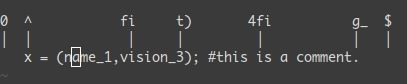

# Vim  

Blog：[简明 VIM 练级攻略](https://coolshell.cn/articles/5426.html)

Reference：[A byte of vim](./resource/A_byte_of_vim.pdf)、[A Vim Guide](http://linuxcommand.org/lc3_adv_vimvigor.php)、[MIT-missing-semester](https://missing.csail.mit.edu/2020/editors/) 、[Vim 实操](https://www.openvim.com/)。


Vim 的本质同 Vscode 一样，是一款优秀的编辑器。比起很多开箱即用的编辑器，Vim 是有一定学习曲线的。Vim 之所以屹立于编辑器领域多年不倒，下面这句话完全解释了其特征：

```
Vim is an editor, which designed to work with keyboard only, without mouse.
```

不同于编辑文本，编程会花费大量时间用于阅读源码，定位文件，少量编辑。

要提高自己的编程效率，需要时时刻刻注意到自己哪里效率特别低，出现了不必要的重复，然后找到更好的办法去改进，并保证自己养成新的习惯。**所谓懒惰，就是不让自己重复做低效的工作**。

> 一定要装一个美国键盘来写程序，而不是在中文输入法中用 shift 切换，且编程时**保持在英语输入法**中。


[toc]

开始学习、复习前，打开终端，键入 `vimtutor`，完成第一步洗礼。以一张速记表善始善终：


## Cursor 

#### location

1. gg G g_

   **移动光标**到文件头、尾，行尾。

2. ctrl + o  ctrl + i

   **移动光标**至上/下一次位置（支持多文件） 

3. ctrl + y  ctrl + e 

   **光标不变**，**文本内容**向上/下**翻一行**（屏幕内容会变）

4. ctrl + u  ctrl + d 

   **光标不变**，**文本内容**向上/下**翻半页**（屏幕内容会变）

5. H M L （结合 zt zz zb）

   **移动光标**到当前屏幕的第一行/中间行/尾行（屏幕内容不变）    

6. zt zz zb（结合 H M L）

   **移动当前行**到当前屏幕的第一行/中间行/尾行（屏幕内容会变）

> `ctrl + g` 显示文件名和光标位置的效果，可以通过 .vimrc 配置文件（安装插件）动态实现。
>
> 注意：区分正常模式下，小写 `zz`、大写 `ZZ` 分别表示移动当前行至屏幕中央、保存并退出文件的不同意义。

#### moving

1. h j k l 

   左、下、上、右 移动光标。

2. \<n\>gg 或 \<n\>G 

   移动光标到第 n 行行首。同 `:n` 将光标定位到 n 行，如果省略数字 <n\> 即默认跳转到文件头、尾行行首。

   > `n + G`、`n + gg`、`:n` 三种方法都能实现跳转到文件第 n 行行首的功能。

3. 0 ^ g_ $ 

   vim 在 normal 模式下，键入 `0` 可以将光标移动到当前行的**绝对行首**，键入 `^` 可以将光标移动到当前行的**第一个非空字符**。键入 `g_` 可以将光标移动到当前行的**最后一个非空字符**。键入 `$` 可以将光标移动到当前所行的**绝对行尾**。

   > 键入 `I`、`A` 后光标分别移动至**第一个非空字符前、绝对行尾后**从行首、行尾插入文本，可以类比 ^ 和 $。

4. f\<char\> t\<char\>

   f (find) 和 t (till) 都是用来在当前行查找到下一个字符。不同的是，f 会包含这个字符，而 t **不会包含这个字符**。反向搜索的话，使用大写的 F 和 T 即可。 键入`;` 可以重复上一次 f/t 查找过程，键入 `,` 可以反方向重复上一次 f/t 查找过程。

   > 其中 t 会停留在下一个字符前，T 反向查找会停留在上一个字符后，在搜索方向前停下。

5. w/W e/E b/B (word/end/back)

   分别表示：**下一个**单词（以非字母字符区分）/字串（以空白字符区分）**首字符**位置，**当前（或下一个**）单词（以非字母字符区分）/字串（以空白字符区分）**末尾字符**位置，**当前（或上一个**）单词（以非字母字符区分）/字串（以空白字符区分）**首字符**位置。

   > 注意：**b/B、e/E** 命令移动光标位置时，若当前光标**已经位于该单词/字串的第一个、最后一个字符**即移动至到**前一个、下一个单词/字串的第一个、最后一个字符**。

## Vim Mode  

Vim 有四种主要模式。在 normal 模式下，提供各种**高效的光标移动和文本操作**；在 insert 插入模式下，即像普通文本编辑器一样进行文本编辑。

任何时刻，都可以在 Vim 的底部状态栏中看到当前所处模式，`ESC` 键可以从任何模式下切换到 normal 模式（也是默认模式**）在绝大多数非文本编辑时刻，Vim 都应该处于 normal 模式下**。

#### normal mode 

默认模式即为 normal 模式，可以执行包括光标移动，删除、复制、粘贴、查找等各种文本操作在内的命令。 如同及时将手放置键盘 f j 位置。在 vim 中要养成及时将模式切换到 normal mode习惯。 

normal 模式下，命令的重复和范围的选择前都可以带一个数字，以便多次执行该命令。例如，5x 可以重复删除字符 5 次，3dw 重复删除单词 3 次。这里 3 的顺序并不重要，d3w 删除 3 个单词仍然同样有效。

> vim 中**单词**（word）以**非字母、数字、下划线**分隔，范围小；而**字串**（WORD）以**空白字符**分隔，范围更大。
>
> 因此一般来说，vim 中的字串比单词更长。 例如，e.g. we're going too slow 包含 5 个字串和 10 个单词（句号和单引号都被当成了单词）

#### insert mode

插入模式，用于键入文本内容，此时在键盘上键入的字符只有字面意义而无实际功能。 由 normal mode 进入 insert mode 的几种方法，如下：  

1. s/S  (substitute) 

   s 删除当前**光标内容**后进入插入模式。 

   S 删除**当前行的内容**后进入插入模式。  

2. i/I  (insert) 

   i 在当前光标(所覆盖)位置前进入插入模式。 

   I 跳转至当前行首个非空字符**前**进入插入模式。  

3. a/A  (afer) 

   a 在当前光标(所覆盖)位置后进入插入模式。 

   A 跳转至当前行绝对行尾**后**并进入插入模式。  

4. o/O  (open) 

   o 在当前行的下一行开辟一个新行后进入插入模式。 

   O 在当前行的上一行开辟一个新行后进入插入模式。

5.  c/C（change）

   C 同 D，删除当前光标至行尾内容后，进入插入模式。

   c 同 d，需要结合其他光标移动字符删除内容后，进入插入模式。

`I == ^i`，`A == $a`。

  > **可以把 `s` 理解为先执行 `x` 删除动作再进入插入模式的动作。**即 `s == xi`。
  >
  > **`S` 为删除当前行的内容**后进入插入模式。**`C` 为删除当前光标至行尾的内容**后进入插入模式。    

#### visual mode

可视模式。在正常模式下键入 `v`，` V`，` <Ctrl-v>` 即可进入可视模式。再针对选中文本执行各种动作和命令。 

1. v -- 进入**字符选中**可视模式。(可类比为 Windows 中的鼠标拖拽选中) 

2. V -- 进入**行选中**可视模式。(此时左右移动无效，上下移动进行行选中) 

3. <Ctrl-v\> -- 进入**（矩阵）块选中**可视模式。(可理解为：行、列选中模式，实现块选中)    

块选择 **`<C-v><move><action>`** 的典型操作：`<C-v> <j/k> <I/A> <content> ESC`，实现在多行同一列的左、右侧添加文本内容。

可视化模式下选择操作区域以后，按下 `d` 会删除（剪切）选择的区域，按下 `y` 会复制选择的区域。再按下 `p` 或 `P` 会粘贴选择的区域（按下 `u`、`U` 分别可以实现小、大写转换）

> `~` 可以实现当个字符的大小写转换。
>
> 配置 clang-format 插件后，可以使用 `V` visual mode 行选中功能，格式化代码。 

#### command mode

在正常模式下，键入 `:` 后即进入命令模式，此时光标会立即跳到屏幕的最下方。在命令模式中可以执行一些替换命令、系统命令和 Vim（插件）命令。

这些命令包括常见的文件操作命令（`:e` 打开，`:w` 保存，`:q` 关闭，`:ls` 显示打开的 buffer 缓冲区）；设置 Vim 环境（`:set nu` ）；在 Vim 中调用 Shell 命令（`:!command_line` ）；文本替换命令（`:%s//` ）；编译、搜索命令（`:make`、`:grep` ）

- :cmd

  `:set nu` 等命令可以写进 .vimrc 配置文件中，每次打开 Vim 时自动加载。

  > 键入 `:set ft?` 等命令后，可以查看 Vim 环境的值。
  >
  > 配置项一般都有"打开"和"关闭"两个设置。"关闭"就是在"打开"前面加上前缀"no"。
  >

- :!shell_cmd 

  当在 Vim 的命令模式下键入 `:!shell_cmd ` 后，会返回终端窗口，并在其中输出命令执行后的结果，再按下键盘上的 Enter 即会重新返回到 Vim 中。

  `:[n]r !shell_cmd ` ==  `:[n]read !shell_cmd `。如果没有显示指定 [n]，默认执行完 shell_cmd 命令后会**将命令的输出添加到当前行的下一行中**，但并不会在终端窗口中显示执行命令后返回打印的消息。

  > 键入 `!!shell_cmd ` 命令后并将输出结果做为当前行的内容,当前行中的原有内容将会被覆盖。
  >
  > **使用 `0`、`$` 表示 [n] 可以分别表示在首行、尾行、指定行后插入命令执行结果，使用 `[.-n]、[.+n]` 分别表示在当前行的前、后 n 行后插入命令执行结果。**

  如果仅仅是为了打开终端执行某些操作，而非文本替换，可以键入 `:term` 打开终端模式进行操作。

## Modification

#### reverse

正常模式下键入 `u` 撤销更改、`ctrl + r` 反撤销（重做）更改。

同理，正常模式下键入 `<C-o>` 返回上一个位置，`<C-i>` 跳转到下一个位置。

#### repetition

1. `.` 重复执行最近的文本修改操作。
2. `;` 重复最近的 `f`、`t` 字符查找操作。
3. `,` 反方向，重复最近的 `f`、`t` 字符查找操作。
4. `n` 重复最近的 `/`、`?` 字符串查找操作。
5. `N` 反方向，重复最近的 `/`、`?` 字符串查找操作。

#### copy、paste

- y 

  `y` 是 yank 复制的意思，通常在其后搭配文本范围实现复制的功能，例如：

  键入 `yi"` 复制引号内内容。

  键入 `ya"` 复制包括引号在内内容。

  键入 `y^` 复制光标至行首的所有字符。

  键入 `y$` 复制光标至行尾的所有字符。

  键入 `yy` 复制光标所在行内容。`Y == yy`

  键入 `yb` 复制光标至当前（上个）单词首字符。

  键入 `ye` 复制光标至当前（下个）单词末尾字符。

  键入 `yw` 复制光标至下一个单词起始处。（不包括下一个单词的内容）

  键入 `y%` 复制到匹配的字符。默认情况下，用于匹配 `()`，`{}`和`[]` 的括号之间文本。

- p

  `p` 是 paste 粘贴的意思，当执行完 `y` 复制或者 `d` 删除（本质是剪切）命令以后，vim 会把文本留在剪切板中。

  p -- 复制内容至光标后的位置。根据复制的内容是 [字符|单词|行] 决定复制后的位置。 

  P -- 复制内容至光标前的位置。根据复制的内容是 [字符|单词|行] 决定复制后的位置。

#### cut、deletion

- r

  r --  用 r 后键入的字符替换光标后的首个字符，不进入插入模式。

  R -- 用 R 后连续键入的字符依次替换光标后的字符直至键入 `esc` 返回 normal 模式，不进入插入模式。

  > **不同与 c、d 命令一般需要结合删除范围，r、s、x 命令已指定操作范围，不需要再指定删除范围。**

- x

  x -- 删除光标后字符，不进入插入模式（类：backspace） 

  X -- 删除光标前字符，不进入插入模式 （类：delete，注意区分大小写和 delete、backspace）

  > `s == cl`，**其中 s、r、x、 只删除一个字符，其中 `r`、`x` 不会进入插入模式，其中 `X` 实现向前删除**。

- d 

  d 是删除的意思，通常在前后搭配一个删除范围实现删除功能。vim 中 delete 删除的本质是 cut 剪切，可以利用 paste 还原(粘贴)内容。

  键入 `dd` 删除光标所在行。

  键入 `di"` 删除引号内内容。

  键入 `da"` 删除包括引号在内内容。

  键入 `d^` 删除光标至行首所有字符。

  键入 `d$` 删除光标至行尾所有字符。`D == d$`

  键入 `db` 删除光标至当前（上个）单词首字符（删除单词首字符）

  键入 `de` 删除光标至当前（下个）单词末尾字符（删除单词末尾字符）

  键入 `dw` 删除光标至下一个单词起始处（不删除下一个单词的起始字符）

  键入 `d%` 删除到匹配的字符。默认情况下，用于匹配 `()`，`{}`和`[]` 的括号之间文本。
  
  > d/c 命令删除命令的本质均为剪切，内容被留在剪切板内，可用 p 命令粘贴。**c 命令语法和 d 命令几乎相同，但是在删除动作后进入插入模式**。**可以把 c 理解为加入进入插入模式的 d 删除动作。** 

> **不同于 s、c 命令在完成删除操作后进入插入模式。r、x、d 完成删除操作后均不进入插入模式。** 

#### inside、around

**区域选择：`<action>a<object>` 或 `<action>i<object>`**。

`<action>a<object>` 中 a 可以理解为 around 实际是单词 a 表示完整对象，<action\> 动作包含空格或者符号，`<action>i<object>` 中 i 为单词 inner 表示对象内部，<action\> 动作不包含空格或者符号本身。

- action 可以是任意需要指定操作对象（文本范围）的动作，比如 `c`、`d`（删除）`y`（拷贝）`v`（可视）

- object 可能是： `w` 一个单词， `W` 一个以空格为分隔的单词， `s` 一个句字， `p` 一个段落。也可以是一个特别的字符：`"`、`'`、`)`、`}`、`]`。

键入 `yiw`、`yaw` 复制当前光标所在单词内容。键入 `diw`、`daw` 删除当前光标所在单词内容。假设有一个字符串 `(map (+) ("foo"))`，光标位于第一个 `o ` 所在的位置。

- `vi"` → 会选择 `foo`.
- `va"` → 会选择 `"foo"`.
- `vi)` → 会选择 `"foo"`.
- `va)` → 会选择`("foo")`.
- `v2i)` → 会选择 `map (+) ("foo")`
- `v2a)` → 会选择 `(map (+) ("foo"))`

> `a` 和 `i` 前可以加上数字 \<n\>\<action\>a\<object\>、 \<n\>\<action\>i\<object\>，对多个（层）object 文本对象选中进行 action 操作。

#### macro recording

**宏录制：`q<macro_name><commands...>q`，执行宏：`@<macro_name>`。**

- `qa` 把你的操作记录在寄存器 a。
- 于是 `@a` 会 replay 被录制的宏 a。
- `@@` 是一个快捷键用来replay最新录制的宏。

在一个只有一行且这一行只有 “1” 的文本中，键入如下命令：`qaYp<C-a>q`

- `qa` 开始录制
- `Yp` 复制粘贴当前行
- `<C-a>` 数字增加 1
- `q` 停止录制
- `@a` → 在 2 下面写下 3
- `@@ == @a` → 在 3 正面写下 4
- `96@@ == 96@a` 会创建新的 96 行，并把数据增加到 100

[1-n] + cursor、action 命令，可以重复 [1-n] 次 cursor、action 动作。包括 cursor 光标跳转、复制 yank、删除 deletion、撤销 reverse、可视 visual 等动作。  

对于重复次数较多、信心较高的修改，我们应当偏向使用自动化程度更高的方式，比如 macro、`:s` 命令等，对于重复次数较少或信心较低的修改，我们应该使用不那么自动化的方式。

## Vim Function

#### search

Vim 可以使用  `/`、`?`、`[g]*` 和 `[g]#` 结合正则表达式向后（下）、向前（上）搜索特定词和字符串。

1. `/search_pattern`、`?search_pattern`

   在 normal 模式下，键入 `/` 或 `?` 后就进入了搜索模式，`/` 用于向后（下）搜索，`?` 用于向前（上）搜索。在键入 `/serarch_pattern<Enter>` 后，再键入 `n` 可以继续向后（下）查找下一个相匹配的目前单词、键入 `N` 的作用与 `n` 相反，继续向前（上）搜索目标单词；键入 `?search_patter<Enter>` 与 `n`、`N` 的作用相同，仅方向不同。

   > 搜索命令默认按 `search_pattern` **字符串包含**来查找。若要按 `search_pattern` 单词匹配来搜索则需要键入 `\<`、`\>` 标记 `\<search_pattern\>` 单词的开头和结尾。

   > Vim 会跟踪您在当前会话中所做的所有搜索操作。要浏览搜索历史，请按 `/` 或 `?` 并使用向上\<C-P\>/向下\<C-N\>查找以前的搜索操作。要运行搜索，只需按`Enter`。还可以在执行操作之前编辑搜索模式。

2. `[g]*`、`[g]#`

   在 normal 模式下，如果要搜索**当前光标下的单词**，可以直接键入 `*` 或 `#` 分别向后（下）、向前（上）搜索。假设光标当前所有单词为 the，那么在当前光标位置执行命令 `*` 相当于搜索命令 `/\<the\>`，命令 `#` 等同于命令 `?\<the\>`。

   在 normal 模式下，如果要搜索**包含当前光标下单词的字符串**，可以键入 `g*` 或 `g#` 分别向后（下）、向前（上）搜索。假设光标当前所有单词为 the，那么在当前光标位置执行命令 `g*` 相当于搜索命令 `/the`，命令 `g#` 等同于命令 `?the`。g == global。

   > **默认情况下，Vim 搜索结果区分大小写**。一种忽略大小写的方法是在搜索模式之后追加 `\c` 。例如 `/Linux\c` 执行忽略大小写的搜索命令。`\C` 强制匹配大小写搜索。

   > `\` 表示转义，当搜索一些特殊的字符，例如：`*`、`[`、`]`、`^`、`%`、`/`、`?`、`~`、`$` 等，需要在它们的前面加上转义符号 `\`。例如 `/vim$` 匹配行尾的 `"vim"`，当需要查找特殊字符时需要使用转义，例如 `/vim\$` 匹配 `"vim$"`。

#### match

`:[range]g[lobal]/{pattern}/[cmd]` 

`:[range]g![lobal]/{pattern}/[cmd]` == `:[range]v[global]/{pattern}/[cmd]`

#### replace

替换命令的语法如下：

```vi
:[range]s/{pattern}/{string}/[flags] [count]
```

- `range` 表示搜索范围

  1. `:1,10s/from/to/` 表示在第 1 到第 10 行（包含第 1，第 10 行）之间搜索替换；
  2. `:2,$s/from/to/` 表示在第 2 到最后一行（包含第 2，最后一行）之间搜索替换；
  3. `:-7,./from/to/` 表示在前 7 行到当前行（包含前 7 行，当前行）之间搜索替换；
  4. `:10s/from/to/` 表示只在第 10 行搜索替换；
  5. `:%s/from/to/` 表示在所有行中搜索替换；

  > 如果没有指定 [range] 范围，则默认搜索替换只作用于当前行。

- `flags` 有如下四个选项：

  1. `e` error， **不显示**错误；
  2. `i` ignore，忽略大小写;
  3. `c` confirm，每次替换前询问；
  4. `g` globle，替换一行中所有搜索结果。如果不加 `g` 选项，则默认替换每行中第一个匹配到的字符串；

  > 这些选项可以合并使用，例如：`icg` 表示不区分大小写，全部替换，替换前询问。
  >
  > flags 如果为具体的数字 n，表示替换每行中第 n 个 {pattern}，ng 则表示替换每行中第 n 个及其以后出现的 {pattern}。

如果在 `:s` 替换命令中使用 `/` 作为模式的分隔符，那么模式中的 `/`  必须使用 `\` 转义字符写作 `\/` 才可。

其中， n,m 表示作用范围 `[range]`（行号范围是包含的）可以用 `.` 表示当前行，`$` 表示最后一行，`%` 代替 n,m 表示全文。默认不填写表示仅作用于光标所在行。

g  是 `[flags]` 之一，表示替换 `[range]` 范围内所有符合 `{pattern}` 模式要求的字符串为 `{string}`。默认不填写标志表示只替换所在行开始第一次出现的 `{pattern}`。

例子:

1. 删除沒有內容的空行：`%s/^$//` 或者 `g/^$/d`
2. 删除行尾空格：`:%s/\s+$//g` 或者 `%s/ +$//`
3. 删除行首多余空格：`%s/^\s*//` 或者 `%s/^ *//`
4. 删除包含有空格组成的空行：`%s/^\s*$//` 或者 `g/^\s*$/d`
5. 删除以空格或TAB开头到结尾的空行：`%s/^[ |\t]*$//` 或者 `g/^[ |\t]*$/d`
6. 把文中的所有字符串“abc……xyz”替换为“xyz……abc”可以有以下写法

```bash
# 圆括号括起来的正则表达式所匹配的字符串会可以当成变量来使用，sed中使用的是\1,\2…
:%s/abc\(.*\)xyz/xyz\1abc/g
:%s/\(abc\)\(.*\)\(xyz\)/\3\2\1/g
```

7. 使用 & 来当做被匹配的变量，然后可以在基本左右加点东西：`%s/my/[&]/g`

浏览 vim 替代命令的历史记录，可输入 `:s` 并使用向上\<C-P\>/向下\<C-N\>查找先前的替代操作命令，类 search 命令中查找命令。并可在执行替代历史命令之前再编辑该命令。然后可按 `Enter`，运行该命令。

> 如果省略 `{string}` 替换内容部分，则将其视为空字符串，即**删除匹配的 `{pattern}` 模式**。
>
> 除了使用 `/` 作为分隔符之外，还可以使用任何其他**非字母数字字符**代替 `/` 斜杠字符。当搜索模式或替换字符串中有 `/` 字符时，此法很有用。

> i/I 也是替换标志之一，i 表示大小写不敏感查找，I 表示大小写敏感。另一种强制忽略大小写的方法是在搜索模式之后追加 `\c`。例如，`/Linux\c` 执行忽略大小写搜索。
>
> 要搜索整个单词，在 `{pattern}` 中键入`\<`以标记单词的开头，输入搜索模式，键入`\>`以标记单词的结尾：例如，要搜索 “foo” 单词，可以使用 `\<foo\>`，`:s/\<foo\>/bar/`

#### regular expression

可在 [Shell](./Shell.md) 中阅读更加详尽的正则表达式知识。

- 元字符

  | 元字符 | 说明                                               |
  | :----: | :------------------------------------------------- |
  |   .    | 匹配 \[^\n] 除换行符外任意字符                     |
  | [abc]  | 匹配方括号中的任意一个字符                         |
  | [a-c]  | 匹配连续字符范围，a-c 中任一个字符                 |
  | [^abc] | 匹配除方括号中字符之外的任意字符                   |
  |   \c   | 忽略大小写进行匹配                                 |
  |   \d   | 匹配阿拉伯数字，等同于[0-9]                        |
  |   \D   | 匹配非阿拉伯数字，等同于\[^0-9]                    |
  |   \x   | 匹配十六进制数字，等同于[0-9A-Fa-f]                |
  |   \X   | 匹配非十六进制数字，等同于\[^0-9A-Fa-f]            |
  |   \l   | 匹配[a-z]                                          |
  |   \L   | 匹配\[^a-z]                                        |
  |   \u   | 匹配[A-Z]                                          |
  |   \U   | 匹配\[^A-Z]                                        |
  |   \w   | 匹配单词字符，等同于[0-9A-Za-z_]                   |
  |   \W   | 匹配非单词字符，等同于\[^0-9A-Za-z_]               |
  |   \h   | 匹配单词首字符，等同于[A-Za-z_]                    |
  |   \H   | 匹配非单词首字符，等同于 \[^A-Za-z _\]             |
  |   \s   | 匹配任意一个空白字符，包括空格、制表符、换页符等   |
  |   \S   | 匹配任意一个非空白字符，包括空格、制表符、换页符等 |

- 一些普通字符需转义

  | 元字符 | 说明          |
  | :----: | :------------ |
  |  \\*   | 匹配 `*` 字符 |
  |  \\.   | 匹配 `.` 字符 |
  |  \\/   | 匹配 `/` 字符 |
  |  \\\   | 匹配 `\` 字符 |
  |  \\[   | 匹配 `[` 字符 |
  |  \\]   | 匹配 `]` 字符 |

- 表示数量的元字符

  | 元字符  | 说明         |
  | :-----: | :----------- |
  |    *    | 匹配0-任意个 |
  |   \\+   | 匹配1-任意个 |
  |   \?    | 匹配0-1个    |
  | \\{n,m} | 匹配n-m个    |
  |  \\{n}  | 匹配n个      |
  | \\{n,}  | 匹配n-任意个 |
  | \\{,m}  | 匹配0-m个    |

- 表示位置的元字符

  | 元字符 | 说明         |
  | :----: | :----------- |
  |   ^    | 匹配行首     |
  |   $    | 匹配行尾     |
  |  \\<   | 匹配单词词首 |
  |  \\>   | 匹配单词词尾 |

- 表示逻辑的元字符

  | 元字符 | 说明                                 |
  | :----: | ------------------------------------ |
  | ~ | 匹配上一次替换的字符串 |
  |  \\&   | 与操作，表示左右每一项都需要匹配成功 |
  | \| | 或操作，表示左右两项中，匹配一项即成功 |

&、| 在正则表达式中的优先级很低，所以很多时候需要使用 \\( 和 \\) 包裹起逻辑与、逻辑或后使用。

> `&` 在正则表达式和替换内容中表达不同的含义，前者表达逻辑关系，后者表达整个匹配内容。

1. 贪婪

   `*`、`\?`、`\+`、`\{\}` 这些表示数量的元字符都属于最长匹配（贪婪匹配）当模式既可以匹配一个较长字符串，也可以匹配一个较短字符串时时，结果会是那个较长字符串。

   Vim 中贪婪匹配对应的最短匹配，只有一种形式，`{-n,m}` 意义和 `{n,m}` 相同，但其结果时最短匹配。

1. 子模式

   元字符 `\(\)` 用来标识一个**子模式**，任何 `\(\)` 内部的匹配文本被称作为一个**子匹配**，都会被自动保存到一个临时的仓库中以便后续进行引用。

   替换变量，可以用 `\1`、`\2` …… `\9` 来依次引用被每对 `\(\)` 捕获的子匹配；不论模式中是否使用了 `\(\)`，元字符 `\0` 永远会自动引用于整个匹配。

   > 如果不需要捕获匹配内容的话，用 `\%(` 和 `\)` 的性能更高。

## Vim Concept

#### tabs

Tab contains windows。Tab 可以想象成浏览器中的标签页，不同之处是 Vim 中的一个 Tab 可以有多个窗口，每个窗口都可以显示文件的内容信息。TAB 相关命令：

`Te`：tab 形式打开当前目录下文件

`:tabc`：关闭 close 当前 tab

`:tabn`：切换到下一个 next tab

`:tabp`：切换到上一个 previous tab

`:tabs`   查看 list 各个 tab 打开的窗口文件 

`:tabnew <tab_name>`   创建一个指定名称的 tab

正常模式下键入 `gt`、`gT` 依次向后、向前切换 tab，`[n]gt` 切换至指定 tab。（tab 的序号默认从 1 开始）

Vim 的标签页即使在纯文本的终端模式中，也是可以使用鼠标点击标签页进行切换，点击 “X” 关闭当前标签页，双击标签页的空白处添加新的标签页。

> 在 Shell 命令行下，可以使用 vim 的 -p 选项来用 Tab 页的方式打开多个文件。
>
> 多窗口下，normal 模式下 `<C-W> T` 按键，可以把当前窗口转变为下一个新标签页。

#### mark

Vim 中使用 mark 可以在当前光标所在位置的文件、行处打上标记，方便我们快速跳转到这个位置。正常模式下键入 m 后紧跟着在按下键盘上（a-zA-Z）当中的任何一个字母，就建立起一个标记。

在 normal 模式下键入 `m[a-zA-Z]`，如 `ma`。就在**当前文件所在光标、行**即建立了个名为 a 的标记。以后可以利用 `'`（单引号） 或者 `` ` (撇号) + 标记的字母，即可跳转到当初标记的所在行。

**‘a 和 `a有什么区别呢？**

```
'a （也就是单引号+a）跳转到当初标记的行首
`a （也就是撇号+a）跳转到当初标记的时候光标所在的位置
```

**ma 和 mA有什么区别？**

```
ma 用于单个文件做标记
mA 用于多个文件之间跳转
```

mark 标记相关命令：

`:marks`   列出所有标记

`:delmarks a`   删除 a 标记

`:delmarks !`   删除所有的小写标记

#### buffers

Vim 会维护一系列打开的文件，Vim 为每个打开的文件创建一个缓冲区，称为 buffers。一个 Vim 会话包含一系列 tabs 标签页，每个 tabs 标签页包含 一系列 windows 窗口（分隔面板 panes）每个 window 窗口**显示而不是包含，不是对应**一个 buffer 缓存，缓冲区就是文件在 Vim 中的映射，但缓存和窗口并不是一一对应的关系。

> `:e` 命令打开的文件不会改变 vim 的命令行参数，但会增加缓冲区数量。命令行参数只能被 `:args` 命令修改。`:ls` 命令可以列出所有缓冲区的信息，相较 `:args` 命令拥有更多的信息，比如光标位置、编号等。

1. splite
   - 水平（上下）分屏：`:sp`
   - 垂直（左右）分屏：`:vsp`
   - 浏览目录，指定文件，水平（上下）分屏：`:He`
   - 浏览目录，指定文件，垂直（左右）分屏：`:Ve`
   
   `:[v]split` 命令后面，如果有文件名，表示分割窗口并打开指定文件；如果没有文件名，那就表示仅仅把当前窗口分割开。 
   
2. buffer

   `vim file_1 file_2 ... file_n`

   相对 \<C-I> \<C-O> 可以在最近的两个位置间切换，使用快捷键 <C-^> 可以在最近的两个缓冲区间切换，范围更大。

   使用该命令打开多个文件时，默认只显示第一个文件，也就是 file_1。此时，再键入 `：ls` 命令，将会在屏幕上列出 Vim 打开的所有文件。

   然后继续输入冒号 `：` 进入命令模式，键入 `b[n]`（这里的 n 值的是 `:ls` 命令显示的缓冲区（文件）序号，如 `b1` 代表打开第一个缓冲区文件，`b2` 代表打开第二个缓冲区文件)。

   > Vim 打开文件时，会自动创建缓冲区，打开几个文件就创建几个缓冲区，默认加载第一个缓冲区，显示第一个文件的内容。

   在 normal 模式下，使用 `:e filename` 命令打开文件，本质上与在命令行下，键入 `vim file_1 file_2 ... file_n` 命令打开文件相同。 
   在内存中，打开一个文件，即新开辟了一个 buffer。可以使用 `:ls` 或者 `:buffers` 命令，查看 Vim 打开的所有 buffers（即 Vim 打开的所有文件）也可以使用 `:b[n]`，跳转到第 n 个 buffer（文件）  

   > `:bn`   切换到下一个缓冲区，`:bp`   切换到上一个缓冲区，`:bd <N>` 删除第 N 个缓冲区。
   >
   > **注意：**由于缓冲区对应文件在计算机内部的存储状态，同一个文件的多个窗口只对应同一个缓冲区。

4. windows

   `ctrl + w + q` 关闭当前的分屏。

   `ctrl + w + o` 只保留当前的分屏。

   `ctrl + w + s/v`  水平/垂直分屏当前一文件。

   `:[v]sp [filename]` 水平/垂直分屏指定文件。 

   `ctrl + w + c` 关闭当前的分屏，但不可关闭最后一个窗口。 

   `ctrl + w + [w|h|j|k|l]` 在不同分屏间切换 。

   `ctrl + w + [H|J|K|L]` 移动当前分屏至指定方向。

   `ctrl + w + = `：恢复各分屏默认尺寸。
   
   `ctrl + w + [+|-] `：增加或减小当前分屏尺寸。
   
   `ctrl + w + [_ or |] `：最大化当前水平或垂直分屏尺寸。
   
   其中`:sp` == `ctrl + w + s`; `:vsp` == `ctrl + w + v`，可以水平/垂直打开**同一文件**。 
   
   把当前窗口转变成一个新标签页，键入 `<C-w> + T` 即可。
   
   > 对**同一文件**的分屏，由于同一文件的不同窗口映射**同一个 buffer 缓冲区**，因此对任何一个窗口的改变都会立刻影响到同一文件的其他窗口。 

在同一个 Vim 会话的多窗口和多标签页里，编辑同一个文件不会发生任何冲突（同步的）文件和缓冲区是一一对应的，窗口和缓冲区没有具体的对应关系，可以把窗口理解为对缓冲区的一种 show。

#### register

Vim 会把要粘贴的（删除和复制命令，如：`d` 和 `y`）内容存在 Vim 的内容寄存器中，而非系统的剪切板。Vim 的寄存器在 normal 正常模式下，可以由 `d`、`y`、`p` 等命令来访问。其中：

- 匿名寄存器

  当操作没有用 `"<reg>` 指定寄存器时，默认使用匿名寄存器。`p == ""p`，`""` 中，第一个 `"` 表示指定指定寄存器动作，第二个 `"` 表示匿名寄存器。

- 0 号寄存器

  0 号寄存器中，永远存放着最近一次复制（yank）的内容。

- / 寄存器

  / 寄存器中，专门存放这搜索的内容。

- _ 寄存器

  _ 寄存器中，专门存放着删除的内容。
  
- = 寄存器

  = 寄存器中，专门存放着 Vim 表达式计算的结果。

## Vim Script  

首先，通过 Vim `:cmd` 命令行模式下执行的命令就是 Vim 脚本。即 Vim 脚本里的代码 == Vim 命令行模式下的命令。Vim 脚本的语法规则，包括字符串和控制语句都类似与 Shell。[Google Vimscript Style Guide](https://google.github.io/styleguide/vimscriptguide.xml) 参考。

#### syntax

Vim 中的 `''`、`""` 单、双引号的区别和 shell 中比较相似，前者内部不允许有任何转义字符。另外 `"` 在 Vim 中还有注释的作用。

**Vim 中的变量用 `let` 命令来赋值（定义）**，支持整数和浮点数，两者都是 64 位有符号类型。整数可以使用 `0b`、`0`、`0x` 前缀分别表示二、八、十六进制。

**Vim 中使用 `set` 命令，为 Vim option 选项赋值**，从而修改 Vim 设置。Vim 中的选项，有些是用等号赋值的，有些不用等号，设置选项名表示 true 肯定，或者在选项名前加 “no”表示 false 否定。

> `let` 命令定义变量时，g: 前缀修饰变量，表示全局变量，s: 前缀修饰变量，表示脚本局部变量，无修饰前缀变量，表示块作用域变量。

Vim 中的 list 列表和 dictionary 字典数据结构，和 python 中对应的数据结构一样。分别使用 `[,]` 和 `{:, :}` 初始化，使用 [] 和 [] 或 . 访问列表和字典成员。其中字典的 key 键会自动转换成字符串，val 值会保留其类型。访问字典不仅可以使用 `[]` 还可以使用 `.`。

> Vim 中一行的第一个非空白字符如果是 `\`，则表示这一行和上一行在逻辑上是同一行，这一点和大部分其他语言是不同的。

表达式本身并不是一个合法的 Vim 命令（脚本语句）在插入和命令模式下，需要使用 <C-R\>= 按键再加上一个表达式来获取表达式结果，在 `:[range]s` 替换命令中，需要使用 `\=` 后跟一个表达式，获取其结果。

Vim 脚本中的表达式跟大部分语言相似，对于文本处理，可以使用 `=~`、`!~` 进行正则表达式的匹配和不匹配，左侧是待匹配的字符串，右侧则是匹配的正则表达式。另外，表达式本身并不是一个合法的 Vim 命令（脚本语句）

> `source`（`so`）命令可以用来载入一个 Vim 脚本，并执行其中的内容。

`command[!]` [避免重复]定义的用户命令，以允许自定义完成一系列 Vim 命令。注意，这个命令的定义必须写在一行，如果命令很长，或者中间出现吞掉 `|` 命令的话，就需要 `execute ""` 命令，把后面字符串当成命令解释。

Vim 中用户自定义函数必须首字母大写，可以使用 `s:` 前缀表示旨在当前脚本有效（static）参数列表结尾，可以使用 `...` 表示不定参数，访问普通有名参数时使用 `a:<para_name>` 前缀，额外参数时需要使用 `a:[N]`，`a:0`，`a:000` 分别表示不定参数的数量和把不定参数作为 list 列表使用，如：a:000[0] == a:1。

#### configure file

Vim 编辑器相关的所有功能，都可以通过 Vim 配置文件进行设置。`vim --version` 命令可以查看当前 vim 的基本功能和配置信息。

  - 用户 .vimrc 配置文件  
    - Vim 的用户个人配置一般位于 `~/.vimrc` 文件下。
  - 系统 .vimrc 配置文件    
    - Vim 的全局系统配置一般位于 `/etc/vim/vimrc` 文件下，对所有用户生效。

> **注意：**各用户的配置文件优先于系统配置文件，Vim 启动时会优先读取当前用户家目录下的 ~/.vimrc 文件。所以与个人用户相关的配置一般都放在 ~/.vimrc 中。

修改 Vim 默认行为，实现定制 Vim 的功能，就是把系统的运行时支持文件复制到当前用户的 ~/.vim 配置目录下的相同位置，然后修改其内容，即可实现对 Vim 行为的精调。

其中不同操作系统平台的 rtp 运行时加载路径是不同的，通过在 Vim 中键入 `:echo $VIMRUNTIME` 可以得到当前平台下的 Vim 系统安装目录结构，其中系统安装目录是不应该去修改的。用户应该在 `~/.vim` 配置目录下修改。

> $ 修饰的变量是 Vim 中自己设置的环境变量（非 Shell 环境变量）
>
> `~/.vim` 用户自定义配置目录，应该和 Vim系统安装目录有相同的结构。另外，可以键入 `:scriptsname` 命令查看 vim 加载脚本过程。

```sh
function! Timezone()
  if has('python')
python << EOF
import time

def my_timezone():
	is_dst = time.daylight and time.localtime().tm_isdst
	offset = time.altzone if is_dst else time.timezone
	(hours, seconds) = divmod(abs(offset), 3600)
	if offset > 0: hours = -hours
	minutes = seconds
	return '{:+03d}{:02d}'
EOF
	return ' ' . pyxeval('my_timezone()')
  else
  	return ''
  endif		  	
endfunction
```

Vim 脚本中通过 `if has('pythonx')` 判断，可以在 `pythonx << EOF` 到 `EOF` 处，可以使用 python 语法，定义 python 函数等。并可在随后的 Vim 脚本中通过 `pyxeval('py_func()')` 调用其函数获得结果。

Vim 脚本中通过 `pyxf *.py` 调用 Python 代码时，Python 代码中 可以访问 Vim 的各个对象，如：`vim.eval` 进行表达式计算，`vim.command` 执行 Vim 命令，`vim.buffers`、`vim.windows`、`vim.tabpages`、`vim.current [buffer|windows|tabpage]`  分别表示 Vim 缓冲区、窗口、标签页对象。Vim 中使用 `pyxf` 来执行某个处理 Vim 的 Python 脚本。

> Vim 中的 `exists()` 内置函数，可以实现检测某一符号（变量、函数等）是否存在；`has()` 内置函数，可以实现检测 Vim 某一特性是否存在。

Vim 变量的前置规则比较复杂，常见的有：`a:` 表示函数参数、`s:` 表示脚本作用域、`g:` 表示全局作用域、`b:` 表示缓冲区作用域、`w:` 表示窗口作用域、`t:` 表示标签页作用域、`v:` 表示特殊的 Vim 内置变量，另外：`&`、`&l:`、`&g:` 分别表示访问（全局、本地）选项的值。

#### plug manager

[vim-plug](https://github.com/junegunn/vim-plug) Github repo 中，记录了该插件管理器的下载和使用方法。下面是简介：

```bash
# install vim-pulg
$ curl -fLo ~/.vim/autoload/plug.vim --create-dirs \
https://raw.githubusercontent.com/junegunn/vim-plug/master/plug.vim
```

vim-plug 的使用，除了在 .vimrc 配置文件中添加 `call plug#begin()` 和 `call plug#end()` 两条语句和其中的插件，不需要任何其他语句。

保存退出 .vimrc 配置文件后，再启动 vim 便可重新加载各 Plug，也可以直接在 vim 中键入 `:source .vimrc` 实现不退出 Vim 加载配置文件的效果。

打开 .vimrc 配置文件后，删除需要移除 Plug 所对应的那一行内容，保存退出 .vimrc 配置文件，再启动，或者在 vim 中键入 `:source .vimrc` 命令。再键入 `:PlugClean` 命令完成清理。

> `PlugInstall`、`:PlugUpdate`、`:PlugUpgrade` 命令分别对 .vimrc 配置文件中指定的 plug 插件和 vim-plug 本身进行安装和更新。 

#### own configuration  

  ```bash
" scientific network for WSL2
" export hostip=$(cat /etc/resolv.conf | grep nameserver | awk '{ print $2 }')
" export http_proxy="http://${hostip}:{proxy_port}"
" export https_proxy="http://${hostip}:{proxy_port}"

" Avoid au executed more than once.
if has('autocmd')
  " au is a feature that trigger actions when certain events happen.
  au!
endif

" 'Q' in normal mode enters Ex mode, almost never want this.
" As for me, sometimes will touch the Q(shift+q) by mistake.
nmap Q <Nop>

" Try to prevent bad habits like using the arrow keys for movement. This is not the only possible bad habit. For example, holding down the h/j/k/l keys for movement, rather than using more efficient movement commands, is also a bad habit. The former is enforceable through a .vimrc, while we don't know how to prevent the latter. Do this in normal mode... But it still can't stop to hold down the h/j/k/l, whoop~
nnoremap <Left>  :echoe "Use h"<CR>
nnoremap <Right> :echoe "Use l"<CR>
nnoremap <Up>    :echoe "Use k"<CR>
nnoremap <Down>  :echoe "Use j"<CR>
" ...and in insert mode
inoremap <Left>  <ESC>:echoe "Use h"<CR>
inoremap <Right> <ESC>:echoe "Use l"<CR>
inoremap <Up>    <ESC>:echoe "Use k"<CR>
inoremap <Down>  <ESC>:echoe "Use j"<CR>

if has('gui_running')
  set guifont=FiraCode\ Nerd\ Font\ 16
  set guifontwide=Noto\ Sans\ Mono\ CJK\ SC\ 17

  let do_syntax_sel_menu = 1
  let do_no_lazyload_menu = 1
endif

set number
set relativenumber

set enc=utf-8
set fileencodings=ucs-bom,utf-8,gb18030,latin1

" Attention here, we do some work by default and the sequence is stil  important
source $VIMRUNTIME/ftplugin/man.vim
source $VIMRUNTIME/vimrc_example.vim

" Universal ctags need be installed by linux.
" C++ project generating tags file cmd: `ctags --fields=+iaS --extra=+q -R .`
" C project generating tags file cmd: `ctags --language=c --langmap=c:.c.h --fields=+S -R .`
set tags=./tags;,tags,/usr/local/etc/systags

" export MANPAGER="/bin/sh -c \"col -b | vim -c 'set ft=man ts=8 nomod nolist nonu norelativenumber noma' -\""
set spelllang+=cjk
set keywordprg=:Man
set formatoptions+=mM

" reserve offset not to scroll
set scrolloff=3
set linebreak

" stop the highlight to search 
nnoremap <esc>^[ <esc>^[
nnoremap <esc> :noh<CR>

set nobackup
if has('persistent_undo')
  set undofile
  " Here for vim syntax, _ is forbiden for all identifier and cotnent
  set undodir=~/.vim/undodir
  if !isdirectory(&undodir)
    call mkdir(&undodir, 'p', 0700)
  endif
endif

" Not like arrow key, the mouse maybe useful in many scenario.
set mouse=a

let s:term_pos = {} " { bufnr: [winheight, n visible lines] }
function! EnterTerminalNormalMode()
    if &buftype != 'terminal' || mode('') != 't'
        return 0
    endif
    setlocal nonumber norelativenumber
    call feedkeys("\<LeftMouse>\<c-w>N", "x")
    let s:term_pos[bufnr()] = [winheight(winnr()), line('$') - line('w0')]
    call feedkeys("\<ScrollWheelUp>")
endfunction

function! ExitTerminalNormalModeIfBottom()
    if &buftype != 'terminal' || !(mode('') == 'n' || mode('') == 'v')
        return 0
    endif
    let term_pos = s:term_pos[bufnr()]
    let vis_lines = line('$') - line('w0')
    let vis_empty = winheight(winnr()) - vis_lines
    " if size has only expanded, match visible lines on entry
    if term_pos[1] <= winheight(winnr())
        let req_vis = min([winheight(winnr()), term_pos[1]])
        if vis_lines <= req_vis | call feedkeys("i", "x") | endif
    " if size has shrunk, match visible empty lines on entry
    else
        let req_vis_empty = term_pos[0] - term_pos[1]
        let req_vis_empty = min([winheight(winnr()), req_vis_empty])
        if vis_empty >= req_vis_empty | call feedkeys("i", "x") | endif
    endif
endfunction

" scrolling up enters normal mode in terminal window, scrolling back to
" the cursor's location upon entry resumes terminal mode. only limitation
" is that terminal window must be focused before you can scroll to
" enter normal mode
tnoremap <silent> <ScrollWheelUp> <c-w>:call EnterTerminalNormalMode()<CR>
nnoremap <silent> <ScrollWheelDown> <ScrollWheelDown>:call ExitTerminalNormalModeIfBottom()<CR>


" vim-plug
call plug#begin('~/.vim/plugged')
" Cool
Plug 'uguu-org/vim-matrix-screensaver' " F1
" Recent files
Plug 'yegappan/mru' " F2
" Using vim-eunuch commands can keep the undo records.
Plug 'mbbill/undotree' " F6
" NERDTree to show the working directory
Plug 'preservim/nerdtree' " F7
" need install fzf package with bat and ripgrep packages to perfect.
" combining with bat and ripgrep tools, we can set FZF_DEFAULT_COMMAND='rg
" --files --sortr modified'
Plug 'junegunn/fzf', { 'do': { -> fzf#install() } }
Plug 'junegunn/fzf.vim' " F8
" need install ctags package to show the identifiers through current buffer.
Plug 'majutsushi/tagbar' " F9

Plug 'morhetz/gruvbox'
Plug 'mbbill/echofunc'
" Implement shell feature mapping to vim, such as :Delete, :Move.
Plug 'tpope/vim-eunuch'
" leaning some useful :G git commands, such as :Gwrite, :Gread, :Gvdiff and :0Gclog, :Gblame.
Plug 'tpope/vim-fugitive'
" <Leader>hu undo stage, <Leader>hs stage, <Leader>hp play difference
Plug 'airblade/vim-gitgutter'
" <Leader>cc to comment, <Leader>cu to undo, <Leader>cs to comment multi
" lines.
Plug 'preservim/nerdcommenter'
Plug 'frazrepo/vim-rainbow'
Plug 'vim-scripts/LargeFile'
" <C-N> to search words to select or not using n or q
Plug 'mg979/vim-visual-multi'
Plug 'vim-airline/vim-airline'
Plug 'skywind3000/asyncrun.vim'
" can configure its options to use ctags generating tags file.
Plug 'ludovicchabant/vim-gutentags'
Plug 'nelstrom/vim-visual-star-search'
Plug 'python-mode/python-mode', { 'for': 'python', 'branch': 'develop' }
" I strongly recommend we configure the compile_commands.json to project
" working directory
" From Make, we can utilize the bear or compiledb tools.
" From CMake, we can utilize the option -DCMAKE_EXPORT_COMPILE_COMMANDS=1.
" A tiny thing we should notice is the possible bug from the mutil-threads, a
" digression.
Plug 'Valloric/YouCompleteMe', { 'do': './install.py --clangd-completer' }
" This plug needs .md file type to :MarkdownPreview open
Plug 'iamcco/markdown-preview.nvim', { 'do': { -> mkdp#util#install() }, 'for': ['markdown', 'vim-plug']}
call plug#end()
" manual installing undowarnnings.vim under ~/.vim/plugin folder

let g:LargeFile = 200
let g:EchoFuncAutoStarBalloonDeclaration = 0

" configure gruvbox theme
set bg=dark
autocmd vimenter * ++nested colorscheme gruvbox


nnoremap <F1> :Matrix<CR>
inoremap <F1> <C-O>:Matrix<CR>
" For WSL 
" vnoremap <F1> :w !clip.exe<CR><CR>
" For Linux 
vnoremap <F1> :w !xclip -selection clipboard<CR><CR>
nnoremap <F2> :MRUToggle<CR>
inoremap <F2> <C-O>:MRUToggle<CR>
nnoremap <F3> :YcmDiags<CR>
inoremap <F3> <C-O>:YcmDiags<CR>
nnoremap <F4> :cclose<CR>
nnoremap <F6> :UndotreeToggle<CR>
inoremap <F6> <C-O>:UndotreeToggle<CR>
" In NERDTree window, typing I to toggele hideen files.
nnoremap <F7> :NERDTreeToggle<CR>
inoremap <F7> <C-O>:NERDTreeToggle<CR>
nnoremap <F8> :Files<CR>
inoremap <F8> <C-O>:Files<CR>
nnoremap <F9> :TagbarToggle<CR>
inoremap <F9> <C-O>:TagbarToggle<CR>
nnoremap <F10> :RainbowToggle<CR>
inoremap <F10> <C-O>:RainbowToggle<CR>
nnoremap <F12> :MarkdownPreviewToggle<CR>
inoremap <F12> <C-O>:MarkdownPreviewToggle<CR>
" <C-i> and <Tab> are strictly equivalent.
" need install llvm or clang-format package and .clang-fromat config file
noremap <silent> <S-Tab> :pyxf /usr/share/clang/clang-format.py<CR>


if !has('gui_running')
  " nerdcommenter don't add to menu
  let g:NERDMenuMode = 0

  " terminal truecolor, for tmux we need add below two cmds to .tmux.conf
  " set -g default-terminal \"tmux-256color"
  " set -ga terminal-overrides \",*256col*:Tc"
  " if exists('+termguicolors')
  " if has ('termguicolors') && ($COLORTERM == 'truecolor' || $COLORTERM == '24bit')
  "   let &t_8f = "\<Esc>[38;2;%lu;%lu;%lum"
  "   let &t_8b = "\<Esc>[48;2;%lu;%lu;%lum"
  "   set termguicolors
  " endif

endif

if has('autocmd')
  function! GnuIndent()
    setlocal cinoptions=>4,n-2,{2,^-2,:2,=2,g0,h2,p5,t0,+2,(0,u0,w1,m1
    setlocal shiftwidth=2
    setlocal tabstop=8
  endfunction

  let g:asyncrun_open = 10

  " choose such as 'source code pro', 'fira code', 'dejavu sans mono for
  " powerline' and so on powerline in system
  let g:airline_powerline_fonts = 1
  let g:airline#extensions#tabline#enabled = 1
  let g:airline#extensions#tabline#show_tab_nr = 0
  let g:airline#extensions#tabline#buffer_nr_show = 1
  " Here we use ellipsis, a single character that represent three dots.
  " For linux, enter insert mode and then press `<C-V> + u2026`, or 
  " `<C-K> + ,.`
  " For windows, enter win+r to search charmap and then select a font to
  " search, click and copy
  " We can use ga to see the ellipsis inner code
  let g:airline#extensions#tabline#overflow_marker = '…'

  " ycm setting
  let g:ycm_use_clangd = 1
  let g:ycm_auto_hover = ''
  let g:ycm_complete_in_comments = 1
  let g:ycm_autoclose_preview_window_after_insertion = 1
  let g:ycm_filetype_whitelist = {
        \ 'c': 1,
        \ 'cpp': 1,
        \ 'java': 1,
        \ 'python': 1,
        \ 'vim': 1,
        \ 'sh': 1,
        \ 'zsh': 1,
        \ }
  let g:ycm_key_invoke_completion = '<C-Z>'
  let g:ycm_goto_buffer_command = 'edit'
  nnoremap <Leader>gt :YcmCompleter GoTo<CR>
  nnoremap <Leader>fi :YcmCompleter FixIt<CR>
  nnoremap <Leader>gd :YcmCompleter GoToDefinition<CR>
  nnoremap <Leader>gr :YcmCompleter GoToReferences<CR>
  nnoremap <Leader>gh :YcmCompleter GoToDeclaration<CR>


  au FileType c,cpp,objc  setlocal expandtab shiftwidth=4 softtabstop=4 tabstop=4 cinoptions=:0,g0,(0,w1
  au FileType json        setlocal expandtab shiftwidth=2 softtabstop=2
  au FileType vim         setlocal expandtab shiftwidth=2 softtabstop=2
  au FileType help,man    nnoremap <buffer> q <C-W>c

  au BufRead /usr/include/*  call GnuIndent()

endif

" automatically close the last quickfix window
aug QFClose
  au!
  au WinEnter * if winnr('$') == 1 && &buftype == "quickfix"|q|endif
aug END


let g:pymode_rope_completion = 1
let g:pymode_reope_complete_on_dot = 0
let g:pymode_syntax_string_format = 0
let g:pymode_syntax_string_templates = 0
let g:pymode_syntax_print_as_function = 1
" some case can boost the startup time contrast to IsGitRepo function.
let g:pymode_rope = !empty(finddir('.git', '.;'))

" Adding below commands to filetype detect config file ~/.vim/filetype.vim
" if exists("did_load_filetypes")
"   finish
" endif
"
" function! s:CheckCPP()
"   if expand('%:t') !~ '\.'
"     setfiletype cpp
"   endif
" endfunction
"
" augroup filetypedetect
"   au! BufRead, BufNewFile *.asm setfiletype masm
"   au! BufRead proxy.pac setfiletype javascript
"   au! BufRead */c++/* call s:CheckCPP()
"   au! BufRead */icnlude/* call s:CheckCPP()
" augroup END

" setting below options to c syntax highlight config file ~/.vim/syntax/c.vim
" and  ~/.vim/syntax/cpp.vim to do syntax highlight fine tuning, which will be
" loaded before the system syntax/c.vim amd syntax/cpp.vim
" let g:c_gnu = 1
" let g:c_no_cformat = 1
" let g:c_space_errors = 1
" let g:c_no_curly_error = 1
" if exists('g:c_comment_strings')
"   unlet g:c_comment_strings
" endif
  ```

## Text and encoding

计算机文件可以分为 text file 文本文件，和 binary file 二进制文件。

文本文件中存放的是用 EOL 行结束符分隔的文本行，二进制文件中没有能够简单转化为文字的信息，也没有文本文件中明确的分隔符。

现代操作系统中在文件系统层次上，已经完全不关心其具体的文件类型和内容了。而人类直接编辑的文本文件，是一种可以直接或者简单编码转后输出到终端上，显示为一行或多行的可识别字符（无乱码）

> 从操作系统文件系统角度上看，文件的内容就是一串比特。
>
> 我们在打开文本文件时看到的乱码，就是文件的编码和打开文件的工具（比如 Vim）以为的编码不同。

#### tool

`:%!xxd` 把二进制文件转换成地址加十六进制数值再加上 ASCii 编码的可读文本工具。`set nowrap` 可以解决因一行（物理行）中字符太多而导致的折行，不再折行。

#### encoding char

把比特通过编码对应到字符的方法，就是编码。最基本的 ASCii 编码，就是把一个字节对应到一个字符。只要出现了非 ASCII 字符，解释方法就太多了。

UTF-8 是 Unicode 中最重要的编码方式，可以把长度从一到四字节的序列编码映射成一个 Unicode 字符。当行长超过屏幕宽度时自动折行，在 Unix 中，每行的 EOL 行结束符，存盘时使用的是 \n（LF）；而 DOS 中，使用的是 \r\n（CR LF）

#### line and end of line

1. 使用 `:%s/\r$//` 命令删除行尾多余的 CR 字符，此时文件的行尾格式保持 unix 不变。
2. 使用 `:e ++ff=dos` 命令强制以 DOS 行尾加载文件；此时文件的行尾格式为 DOS 的 CR LF；

此外，uinx 格式的文本文件，任何一行都以行结束符结尾，包括最后一行。而 Windows 上则允许最后一行不以行结束符结尾，这样的文件用 Vim 打开，会给出 "[noeol]" 提醒。存盘时，Vim 会自动在最后添加一个行结束符。

## Tricks  

`:w !sudo tee %` 提高权限写入。

`ldd` 查看可执行文件链接动态库，`xxd` 编辑打开二进制文件。Vm 中 `:%!xxd`

`vim **/*.h **/*.cpp` 命令中， `**` 不仅包含所有子目录，也包含了当前目录。

在 Insert 模式下，可以输入一个词的开头，然后键入 `<C-P>`（选择） 或 `<C-N>`（默认选择），自动补齐功能就出现。与此类似的，还有更多的补齐，都在 `<C-X>` 下面，可自行搜索，但有了 YCM 等插件后，需求性大大降低。

```bash
# In wsl2, copy file content in visual mode.
vnoremap <F1> :w !clip.exe<CR><CR>
```

### Conflict

**不同终端窗口中，键入多个 Vim 命令，打开多个会话，编辑同一个文件，会产生冲突信息**，此时应该在产生冲突信息的终端窗口里，选择退出该会话（退出编辑）

**Vim 命令会话在运行中，如果崩溃（被其他进程 kill）重新打开文件，可以看到 swap 文件**。此时应该选择键入 `r` 恢复其中内容并存盘；再次打开该文件时，swap 文件还在，删除该交换文件即可。

当出现 Attention！Swap file ... already exists! 错误提示时，当进程 ID（process ID）后面没有 STILL　RUNNING 提示时，就是上次编辑文件时意外崩溃了，否则就是另一个 Vim 会话中编辑同一个文件。Vim 支持即使在没有存盘的情况下仍然保存上次编辑的状态。

> 使用 r 恢复上次崩溃时编辑状态后，Vim 不会自动删除 swap 文件，可以在重新打开时按 d 删除交换文件。
>
> 因此，尽量避免打开多个 Vim 会话编辑同一个（工程文件夹内）文件。只有多会话编辑才会导致，同一文件可能的冲突。

兼容 xterm 的终端下，使用鼠标时：

- 不按修饰键，直接选中时，鼠标选择产生 Vim 内部的 Visual 模式下的可视选择。
- 按下 Shift 时，鼠标选择的文本产生操作系统的文本选择，用于跟其他应用程序交互。

### Shortcut

- [N]\<C-^\>

  跳转到指定缓冲区。

- \<C-^\>

  在最近的两个缓冲区之间切换。

- earlier \<N\>\<m|s\>

  返回 ?[m/s] 分钟、秒前的状态。 

- later  \<N\>\<m|s\>

  返回 ?[m/s] 分钟、秒后的状态 。

- << ， >>   ==> clang-format plug

  分别表示将当前**光标所在行向左缩进，向右缩进**。  

- :E   ==> NERDTree  plug

  浏览目录命令，在界面内可以移动光标，进入文件。

- **q:**

  打开历史命令窗口。该窗口支持所有 vi 操作的编辑。

- gg = G 

  全文自动缩进 。注意：`gg`，`G` 跳转至文件首行，末行。

  `n + gg` == `n + G` == `:n`，三种方法都可以跳转到第 n 行。 

- **ZZ**

  正常模式下键入 **ZZ == :wq**。注意区分：zz 将当前行移动至屏幕中央。

- x + p 

  交换两个字符。 先利用 `x` 剪切，光标移动至原先字符右字符后再粘贴。

- d + w + w + P 

  交换两个单词。原理同上。注意光标位于单词中可以利用 `b`，返回单词首字符。

  > p、P -- 复制内容至光标后、前的位置。根据复制的内容是 [字符|单词|行] 决定复制后的位置。 

- ga

  打印出当前光标下字符的内码。

- gf 

  如果当前光标所在位置为 filename，则打开该文件。  

- gd 

  如果当前光标所在位置为 varname，则移动光标至该局部变量定义处。 

### Easter Eggs

- vim 总结

  

  

- 分行、分段

  如果之前换行符不代表分段，现在希望换行即分段。可以使用 `J` 命令 join 连接多行成一行，这个命令，在某中程度上可以理解为 `gq` 命令的逆命令。

- 复制、粘贴

  Vim 中简单鼠标选中表示进入可视模式，需要使用 shift + 鼠标，接管 Vim 对鼠标的相应，而 ctrl+c 和 ctl+v 在 Vim 中不是简单的复制和粘贴，需要添加 shift 前缀。

  > 简单的 shift + 鼠标，不支持跨屏幕内容选中，所以需要插件支持，可见配置文件的 F1 映射。

- 双窗口比较

  `vimdiff`：

  `gvimdiff`：

  `git difftool`：

- 提高用户权限

  `:w !sudo tee %`

  `w` 将当前缓冲区的文件内容写入标准输出或者指定文件中，tee 命令从标准输入中读取信息，输出到标准输出和指定文件中（`%` 表示当前缓冲区的文件名）

- vim 清除搜索高亮

  为了方便，Vim 中，可以映射快捷键来简化操作。定义在 Vim 正常模式（n）下非递归（nore）键盘映射（map）: `nnoremap <esc> :noh<return><esc>` 来关闭当前高亮搜索结果。另外，需要加入: `nnoremap <esc>^[ <esc>^[` 命令来避免 Vim 内部使用 <esc\>

- vim 实现（垂直）多行编辑

  进入 Vim 可视化模式：

  (1) 键入 `Ctrl + v` 进入块选中的可视化模式。

  (2) 键入 `jk` 移动光标，在文本中选择需要操作的行。

  操作：

  (3) 键入大写的 `<I|A>` 进入插入模式。 

  (4) 插入模式下键入文本后，键入 `Esc` 回到正常模式。


Vim 中关于 `:make` 命令的错误信息是在 quickfix 窗口中处理，像键入 `:E` 命令浏览目录那样可以在 quckfix 窗屏中使用 j, k 按键上下移动到相应的错误上然后按下 Enter 回车，定位到相应的源文件出错代码行。但是，要定位下一条错误还得用 Ctrl + W + W 回到 quickfix 窗口中，重复操作。可以使用下面命令，在 quickfix 中直接操作：

> **:cl 列出所有错误**
>
> **:cp 跳到上一个错误**
>
> **:cn 跳到下一个错误**
>
> **:cc 显示错误详细信息**

要提高自己的编辑效率，需要时时刻刻注意到自己哪里效率特别低，出现了不必要的重复，然后找到更好的办法去改进，并保证自己养成新的习惯。所谓懒惰，就是不让自己重复做低效的工作。


`=` 有自动缩进的功能，所以**在 normal 模式下键入 `=%`、`gg=G` 分别实现语句块、全文缩进**。

懒就是勤快，忙碌就是还不够懒，嘿嘿。
